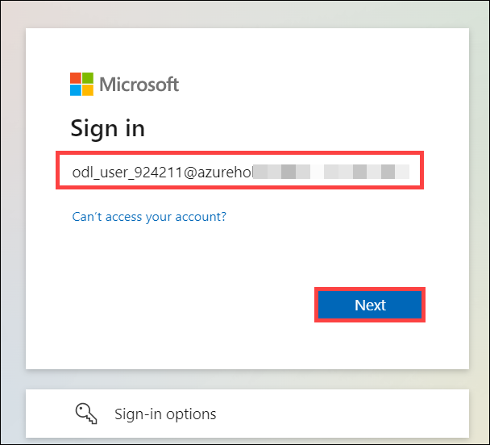
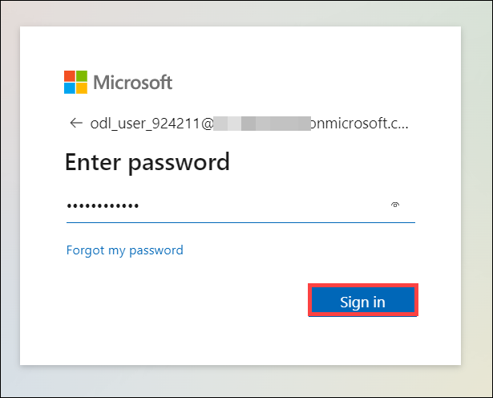
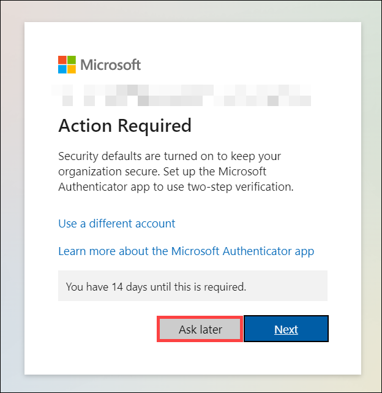
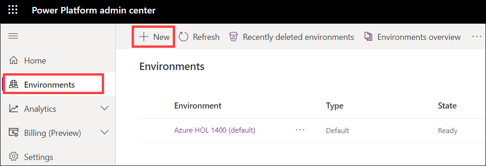
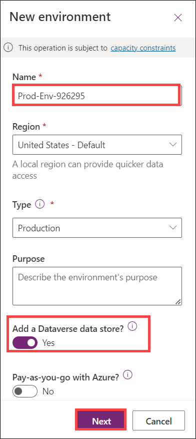

# Practice Lab - Setup Dynamics 365 for Customer Service

## Scenario

In this Module 0 lab, you will validate and set up your tenant. You will have access to your individual credentials, and record your DeploymentID from the environment details tab. We will be using that throughout the course.

**Important notice for instructors:** Please do not make any changes, including adding licenses or changing tenant password. Tenants are fully provisioned with all necessary licenses, environments, and applications to complete the required tenants. Instructors and students should not add any additional functionality outside of the published lab steps. Adding additional functionality will cause the tenant to break and become inactive, and changing tenant password will inhibit the recycling of the tenant for the next class. Thank you for your cooperation.

**Important notice for instructors and students:** This lab will provide you with an actual Dynamics 365 tenant and licenses for the Power Platform applications you will be using in this course. Please be aware that the Power Platform is evolving all the time. The instructions in this document may be different from what you experience in your actual tenant. It is also possible to experience a delay of several minutes before the virtual machine has network connectivity to begin the labs.

## Exercise 1 - Access the Dynamics 365 application

### Task 1 – Log into the Power Platform admin center

1. Access <https://admin.powerplatform.microsoft.com> 

1. Enter your username and password, which can be found under the environment details tab.

    

    

1. On the **Action Required** page, select **Ask Later**. and select **No** on the **Stay Signed in** page.

    

    

1. Feel free to explore the Power Platform admin center but **do not make any changes.**

### Task 2 – Create Environment into the Power Platform admin center

1. On the Power Platform admin center, On the navigation pane, select **Environments**. Now on the environments page, you will see a **default environment present**. Do not **use**, **modify** or **delete** the **default** environment.

    

1. Now to create a new environment, select **+ New**.

    

1. On the **New environment** page, specify the following settings and click on **Save**:

   |Setting|Value|
   |---|---|
   |Name|**Prod-Env-[DeploymentID]**|
   |Region|**United States**|
   |Type|**Production**|
   |Add a Dataverse data store?|**Enabled** and select Next|
   |Enable Dynamics 365 apps?|**Enabled**|
   |Security group|click on **+ Select** and select the **None** option from the list and click on Done|
   
   >Note: The **[DeploymentId]/[DID] can be found under the environment details tab in the user name (example: `odl_user_xxxxxx.onmicrosoft.com`) **xxxxxx** is the [DeploymentID]**.
   
   >**Note**: Wait for the Environment to get ready before you continue with this lab.

   
   
   

### Task 3 – Access the Dynamics 365 application

1. On the Power Platform admin center, select the **Prod-Env-[DeploymentID]** environment.

1. Select the **Open** located on the command bar.

1. From the list of available Dynamics 365 apps, select the **Customer Service Hub** app.

   

1. Spend a few minutes exploring the application.
