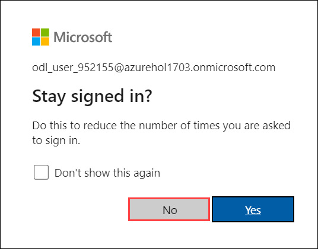
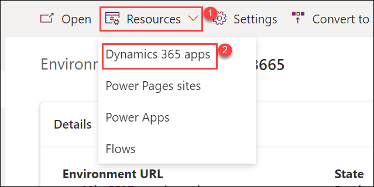
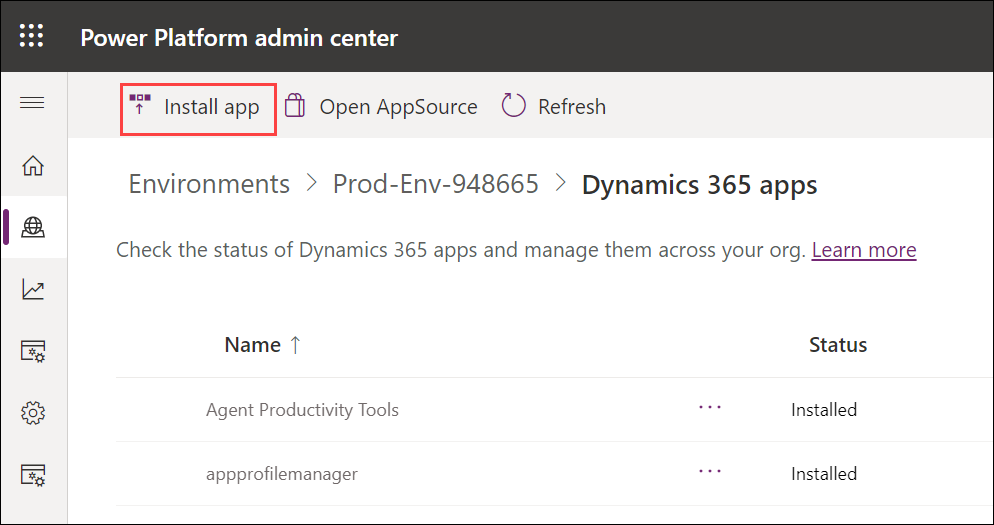
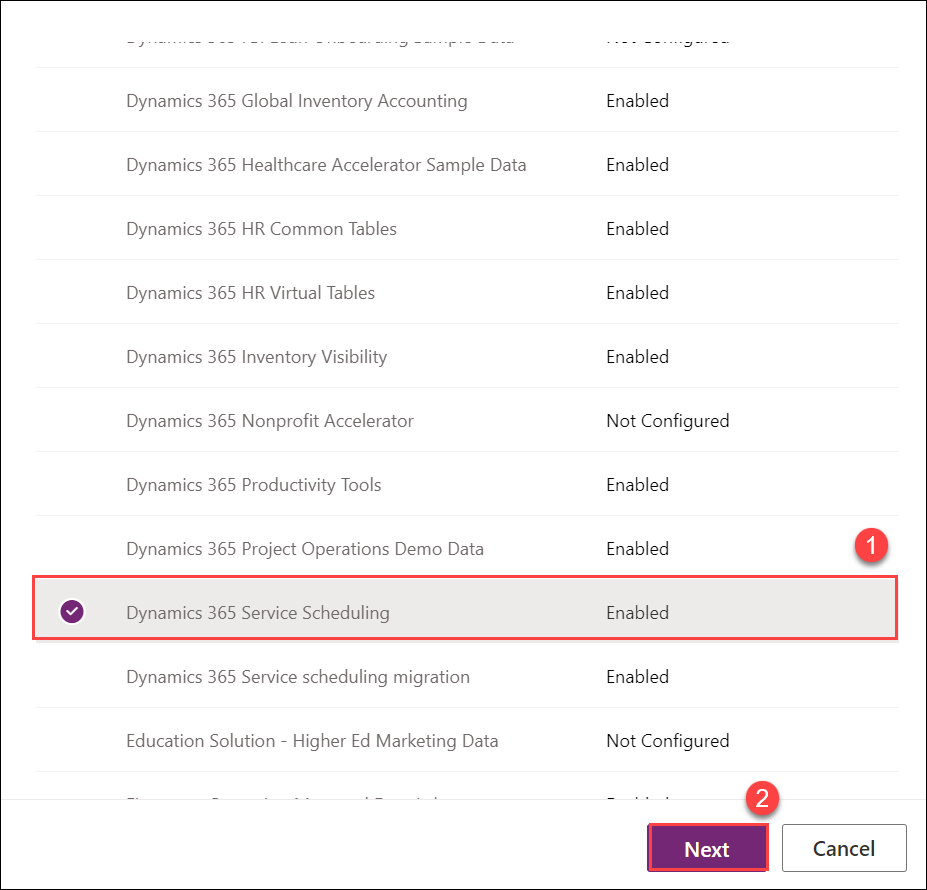
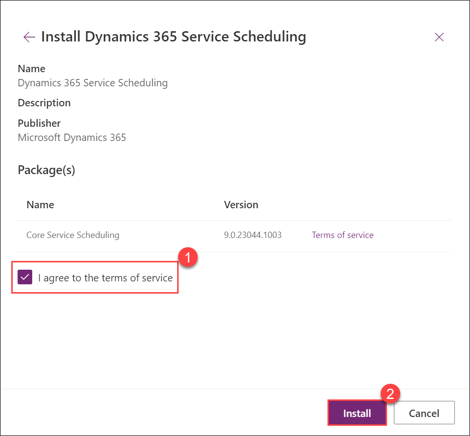
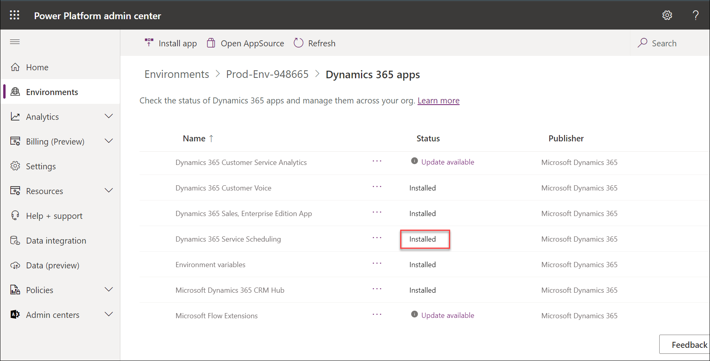
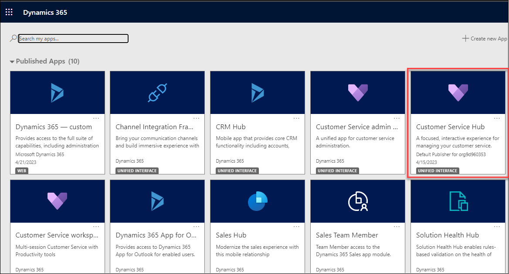

# Module 00 - Setup Dynamics 365 for Customer Service

## Scenario

Dynamics 365 for Customer Service is the backbone of their customer support operations. With hundreds of inquiries pouring in daily, the system effortlessly manages the entire customer service lifecycle. When a customer contacts the company with a product issue, a support agent swiftly creates a case in Dynamics 365, capturing all relevant details. The system intelligently assigns the case to the most suitable agent based on their expertise, workload, and availability. Armed with a comprehensive view of the customer's history, the agent promptly reaches out to the customer, providing personalized assistance and resolving the issue. Collaborating with colleagues within the system, they share knowledge articles and seek assistance when needed. The system ensures adherence to service level agreements, automatically escalating cases that require immediate attention. Managers leverage the system's analytics capabilities to monitor team performance, identify bottlenecks, and make data-driven decisions. After successful resolution, customer feedback surveys are automatically triggered, enabling the company to gauge customer satisfaction and continuously improve their support services. With Dynamics 365 for Customer Service at the helm, the company delivers exceptional customer experiences, solidifying their position as a leader in the industry.

In this practice lab, you will validate and set up your tenant.

## Exercise 1 - Access the Dynamics 365 application

### Task 1 – Log into the Power Platform admin center

1. Nevigate to access <https://admin.powerplatform.microsoft.com> 

1. If not Sign-in, then on the **Sign into Microsoft Azure** tab you will see the login screen, in that enter following **Email/Username** and then click on **Next**. 
   * Email/Username: <inject key="AzureAdUserEmail"></inject>
   
    
    
1. Now enter the following **Password** and click on **Sign in**.
   * Password: <inject key="AzureAdUserPassword"></inject>

    

1. If you see the pop-up **Action Required** page, select **Ask Later**.

    

1. If you see the pop-up **Stay Signed in?**, click No.

    

1. If you see the pop-up  **Welcome to the Power Platform admin center!** click on **X** at the top right corner,
1. Feel free to explore the Power Platform admin center but **do not make any changes.**

### Task 2 – Create Environment into the Power Platform admin center

1. On the Power Platform admin center, from the navigation pane, select **Environments(1)**. Now on the environments page, you will see a **default environment present(2)**. Do not **use**, **modify** or **delete** the **default** environment.

    

1. Now On the Power Platform admin center, On the **Environments(1)** pane, select **+ New*(2)** to create a new  environment.

    

1. On the **New environment** page, specify the following settings:

   |Setting|Value|
   |---|---|
   |Name|**Prod-Env-[DeploymentID](1)**|
   |Region|**United States(2)**|
   |Type|**Production(3)**|
   |Add a Dataverse data store?|**Enabled(4)** and select **Next(5)**|
   
1. Now scorll-down and specify the following settings and click on **Save**:

   |Setting|Value|
   |---|---|
   |Enable Dynamics 365 apps?|**Enabled(1)**|
   |Security group|click on **+ Select(2)** and on the the **Edit security group page** select **None(3)** option from the list and click on **Done(4)**|
   
   >Note: The **[DeploymentId]/[DID] can be found under the environment details tab in the user name (example: `odl_user_xxxxxx.onmicrosoft.com`) **xxxxxx** is the [DeploymentID]**.
   
   >**Note**: Wait for the Environment to get **ready** before you continue with this lab.

   
   
   
   
### Task 3 - Intalling Dynamic 365 Service Scheduling.

1. On the Power Platform admin center, select the **Prod-Env-[DeploymentID]** environment.

   
    
1. Select **V** besides **Resources** located on the command bar, then from the drop-down select **Dynamic 365 apps**.

    
    
1. Click on **Install app** located on the command bar.

    
    
1. Search and Select **Dynamic 365 Service Scheduling(1)** then click on **Next(2)**.

    
    
1. On the **Install Dynamic 365 Service Scheduling** page, check the **I agree to terms of service(1)** box then click on **Install(2)**.

    
  
     >**Note:** It will take 25-30 minutes to get install. Once it got installed you can see that the status got changed from **Installing** to **Installed**.
 
      

### Task 4 – Access the Dynamics 365 application

1. On the Power Platform admin center, select the **Prod-Env-[DeploymentID]** environment.

1. Select the **Open** located on the command bar.

1. From the list of available Dynamics 365 apps, select the **Customer Service Hub** app.

   

1. Spend a few minutes exploring the application.

> **Result:** You have successfully created your Dynamics 365 environment. 
