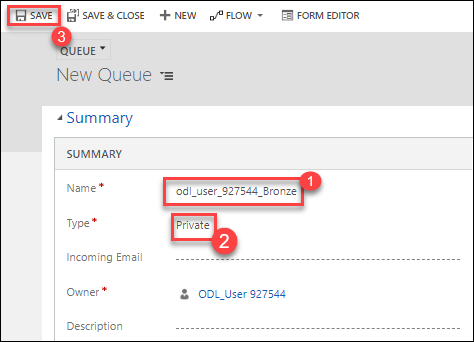
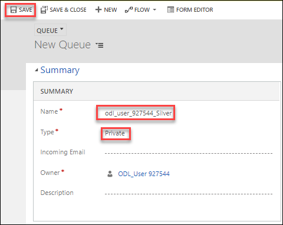
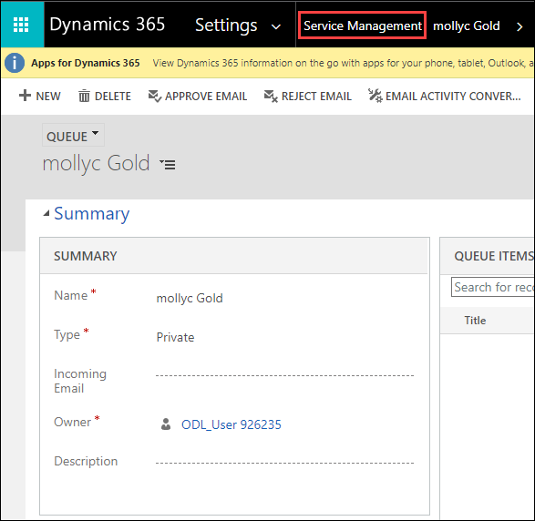
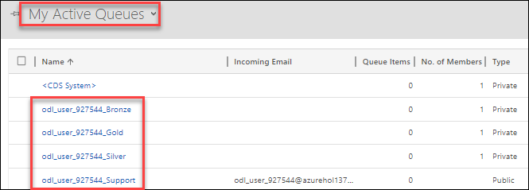
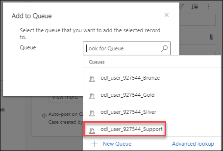

# Practice Lab 2 – Queues

## Scenario

You are a customer service manager at City Power & Light. You need to create queues for the customer service representatives to use for processing cases. In this lab, you will create a create multiple queues and add cases to activities to queues.

> `Important`: The **[DeploymentId]/[DID] can be found under the environment details tab in the user name (example: `odl_user_xxxxxx.onmicrosoft.com`) **xxxxxx** is the [DeploymentID]**.

## Exercise 1 – Create Queues

In this exercise, you will create four queues.

### Task 1 – Create Queues

1.  Open the **Customer Service Hub** app.

2.  Click on **Settings** from the top right corner and select **Advanced settings**.

    
    
3. On the new page, select the Settings drop down and click on **Service Management**.

    

4. Click on **Queues** in the **Case Settings** section.

    

5.  Click **+ New** located on the command bar.

6.  Enter **odl_user_DID_Support** for **Name** and select **Public** for **Type**, and enter the user name from the environment details pages of the lab guide ex. `odl_user_926235@azureholxxxx.onmicrosoft.com`  for **Incomming Email**.

7.  Click **Save**.

    

8.  Click **+ New**.

9.  Enter **odl_user_DID_Bronze** for **Name** and select **Private** for **Type**.

10.  Click **Save**.

    

11. Click **+ New**.

12. Enter **odl_user_DID_Silver** for **Name** and select **Private** for **Type**.

13. Click **Save**.

    

14. Click **+ New**.

15. Enter **odl_user_DID_Gold** for **Name** and select **Private** for **Type**.

16. Click **Save**.

    

17. Click on **Service Management** to go back to case settings.

    

18. Click **Queues** under the **Case Settings** section.

19. Select the **My Active Queues** view.

    

20. You should now see a private queue that was created for your user automatically, the public queue, and three private queues that you created in this lab.

    

21. Close the current tab and navigate back to the previous "services" page.

22. On the services page, refresh the page and Click **Queues** under the **Service** section.

23. Change the view from **Items I am working on** to **All items**

    

24. Review the options in the list for **Queues I'm a member of**. You should be able to see the four queues you created.

    

### Task 2 – Add cases to queues

1.  Open the **Customer Service Hub** app.

2.  Click on **Cases** in the **Service** section of the sitemap.

3.  Select the **odl_user_DID_Service Required** case you created in the earlier lab.

4.  Click **Add to Queue** located on the command bar.

    

5.  Enter *your prefix ex. odl_user_DID* in the **Queue** field, click on the lookup icon and select the **Bronze** queue you created in the task

6.  Click **Add**

    

7.  Click on **Cases** in the **Service** section of the sitemap.

8.  Select the **odl_user_DID_Defective Screen** case you created in the earlier lab.

9.  Click **Add to Queue** located on the command bar.

10. Enter *your prefix ex. odl_user_DID* in the **Queue** field, click on the lookup icon and select the **Support** queue you created in the task

11. Click **Add**

    

12. Click **Queues** under the **Service** section.

13. Change the view from **Items I am working on** to **All items**

14. You should see the Service Required case listed for the Bronze queue.

15. Change the queue selector from **Queues I'm a member of** to **All Public Queues**.

16. You should see the Defective Screen case listed for the Support queue.

17. Change the queue selector to **All Queues**.

    

### Task 3 – Perform actions on queue items

1.  Click **Queues** under the **Service** section.

2.  Change the view from **Items I am working on** to **Items available to work on**.

3.  Change the queue selector to **Queues I'm a member of**.

4.  You should see the Service Required case listed for the Bronze queue.

5.  Click to the left of the case in the queue to select it.

6.  Click **Queue Item Details** located on the command bar.

7.  Note that **Worked By** is blank.

    

8.  Click **Close** from the three dots.

9.  Click to the left of the case in the queue to select it.

10. Click **Pick** located on the command bar.

    

11. Leave the *Also remove the item(s) from the Queue* option set to **No**, and click **Pick**.

12. Change the view from **Items available to work on** to **Items I am working on**.

13. Click to the left of the case in the queue to select it.

14. Click **Queue Item Details** located on the command bar.

15. Note that **Worked By** is set to your user.

    

16. Click **Close**

17. Click to the left of the case in the queue to select it.

18. Click **Release** located on the command bar and click **Release**.

    
