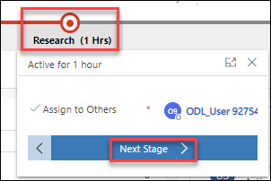
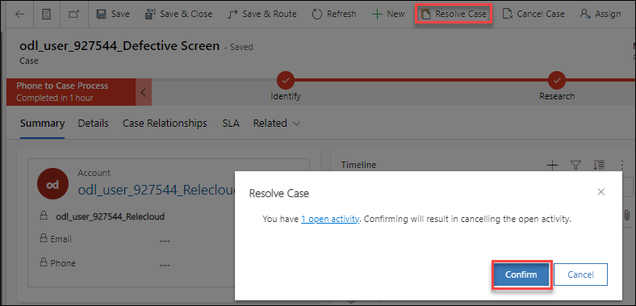
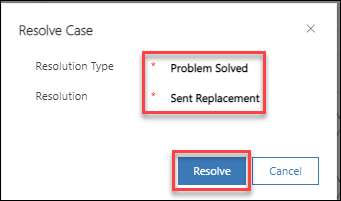

# Practice Lab 3 – Resolving cases

## Scenario

You are a customer service manager at City Power & Light who has been tasked with trying the new case resolution and reactivation functionality before rolling it out to your users. In this lab, you will resolve a case and reactive that case.

## Exercise 1 – Resolve Cases

### Task 1 – Resolve Case

1.  Open the **Customer Service Hub** app.

2.  Click on **Home** at the top of the left-hand side navigation.

3.  Click on **Cases** in the **Service** section of the sitemap.

5.  Open the **Defective Screen** case you created.

6.  Click on the **Research** stage of the **Business Process Flow**.

7.  Click **Next Stage**.

    

8.  The **Business process Flow** will advance to the **Resolve** stage. Click on the **Resolve** stage and click **Finish**.

9.  Click on the **Resolve Case** button located in the command bar. Note: You may need to click the ellipsis (...) to see the button.

10. A dialog will be displayed with the message *There are open activities associated with this case. The open activities will be cancelled if you resolve this case. Do you want to resolve the case?*.

11. Click **Confirm**.

    

12. Select **Problem Solved** for **Resolution Type** and enter **Sent Replacement** for **Resolution** and click **Resolve**.

    

### Task 2 – Reactivate Resolved Case

1.  Click **Cases** under the **Service** section.

2.  Change the **View** from **My active Cases** to **Resolved Cases**.

3.  Open the case you resolved in task 1.

4.  Click on the **Reactivate Case** button located in the command bar. A dialog will be displayed with the message to confirm, Select **Reactivate**.

    

5.  Change the **Case Title** to **odl_user_DID_Defective Screen Not Received** in the **Details** tab.

6.  Click **Save & Close**.
