# Practice Lab 5 – Entitlements and templates

## Lab scenario

As a customer service manager at City Power & Light, you need to create entitlements and entitlement templates to manage complex service offerings and guide your team in processing cases from various channels. In this lab, you will create an entitlement with entitlement channels. You will also create an entitlement template and create an entitlement from the template.

## Lab objectives
In this lab, you will perform:
+ Exercise 1 – Entitlements
+ Exercise 2 – Entitlement Templates
+ Exercise 3 – Service Level Agreements

## Estimated time: 40 minutes

## Exercise 1 – Entitlements

In this exercise, you will create an entitlement for your user, this entitlement will allow you to create 50 cases through the Email channel, 30 Cases through the Web channel, and 10 Cases each for Twitter and Facebook channels.

### Task 1 – Create Entitlement

1.  Click on the **Customer Service Hub** app from the top and select **Customer service admin**.

    
    
1.  Using the navigation on the left, select **Service Term (1)** under **Operations** and Select **Manage (2)** next to **Entitlements**.

     
     
1.  Click **+ New** located on the command bar.

1.  On **New Entitlement** page, follow the below instructions:

     - Name : Enter **Entitlement 1 (1)**
     - Primary Customer : Select **Relecloud (2)**
     - Start Date : Select today's date **(3)**
     - End Date : Select a month from today **(4)**
     - Restrict based on entitlement terms : Choose **Yes (5)**
  
        

1. Under **ENTITLEMENT TERMS** follow the below instructions:

  - Allocation Type : Select **Number of Cases (1)** 
  - Decrease Remaining On : Select **Case Creation (2)** 
  - Total Terms : Enter **100 (3)** 
  - Click on **Save (4)**

     

  > **Note:** DO NOT navigate away from the Entitlement form.

> **Congratulations** on completing the task! Now, it's time to validate it. Here are the steps:
> - Select the **Lab Validation** tab located at the upper right corner of the lab guide section.
> - Hit the Validate button for the corresponding task. If you receive a success message, you can proceed to the next task. 
> - If not, carefully read the error message and retry the step, following the instructions in the lab guide.
> - If you need any assistance, please contact us at labs-support@spektrasystems.com. We are available 24/7 to help you out.

### Task 2 – Add Channels to the entitlement

In this task, you will add entitlement channels to the default entitlement and then activate the entitlement.

1.  In the **Entitlement Channel** section of the Entitlement form, click on the ellipsis (...) and select **+ New Entitlement Channel**.

    

2.  Select **Email** for **Name**, enter **50** for **Total Terms** and click **Save & Close**.

    

3. Navigate back to the **Entitlement Channel** section of the Entitlement form, click on the ellipsis (...) and select **+ New Entitlement Channel**.

    
    
4.  Select **Web (1)** for **Name**, enter **30 (2)** for **Total Terms** and click **Save and Close (3)**.

    
     
5. Navigate back to the **Entitlement Channel** section of the Entitlement form, click on the ellipsis (...) and select **+ New Entitlement Channel**.

6.  Select **Facebook (1)** for **Name**, enter **10 (2)** for **Total Terms** and click **Save and Close (3)**.

     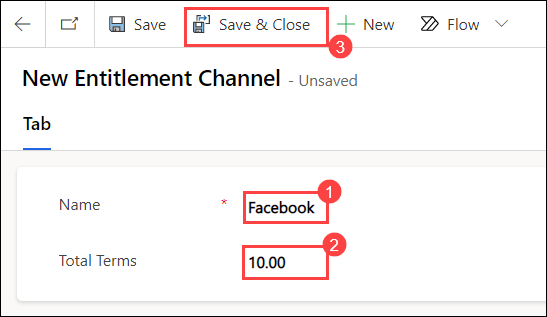
     
7.  Click on the ellipsis button and select **+ New Entitlement Channel**.
     
8.  Select **Twitter (1)** for **Name**, enter **10 (2)** for **Total Terms** and click **Save and Close (3)**.

     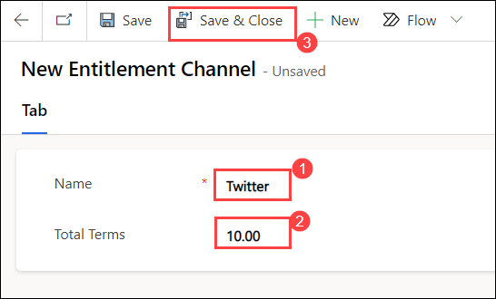
     
9.  Click on the ellipsis button and select **+ New Entitlement Channel**.

10. Select **Phone (1)** for **Name**, enter **0 (2)** for **Total Terms** and click **Save and Close (3)**.

    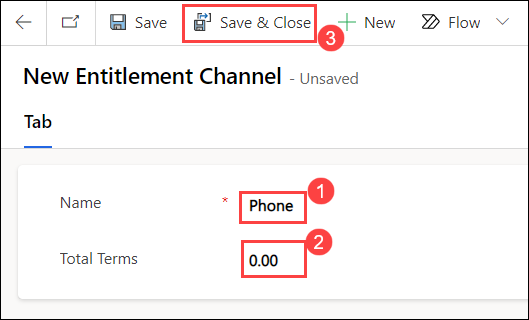
    
11. Click on the ellipsis button and select **+ New Entitlement Channel**.

12. Select **IoT (1)** for **Name**, enter **0 (2)** for **Total Terms** and click **Save and Close (3)**.

    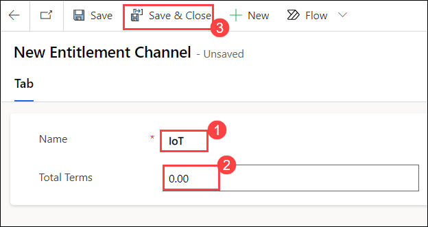

13. Click **Activate**.

    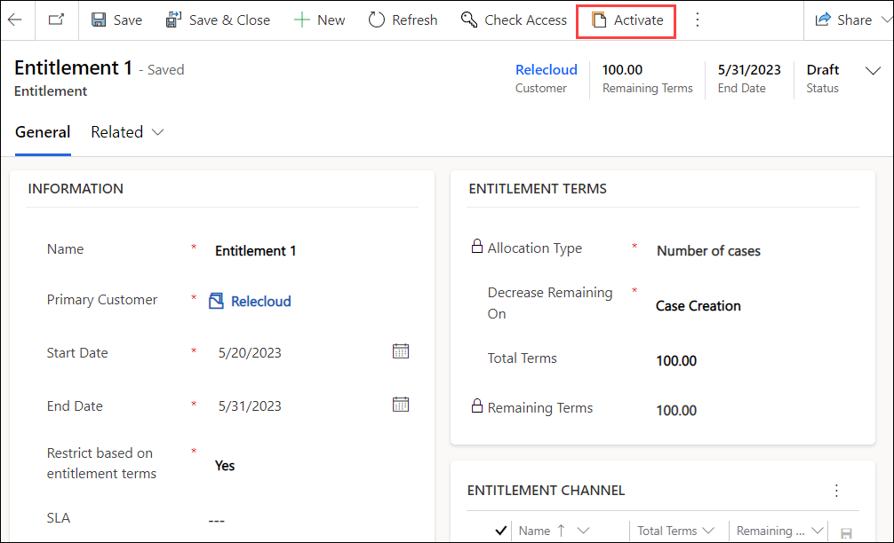
    
14. On **Confirm Entitlement Activation** tab, click on **Activate**.

    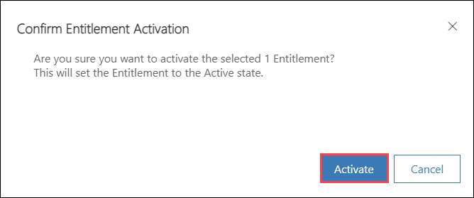

15. Click **Set as Default**.

16. Click **Confirm**.

### Task 3 – Test the Entitlement

In this task, you will test the default entitlement for Relecloud.

1.  Switch back to the **Customer service Hub** tab.

1.  Click on **Home** at the top of the left-hand side navigation.

1.  Click on **Cases (1)** in the **Service** section of the sitemap and click on **+ New Case (2)**.

     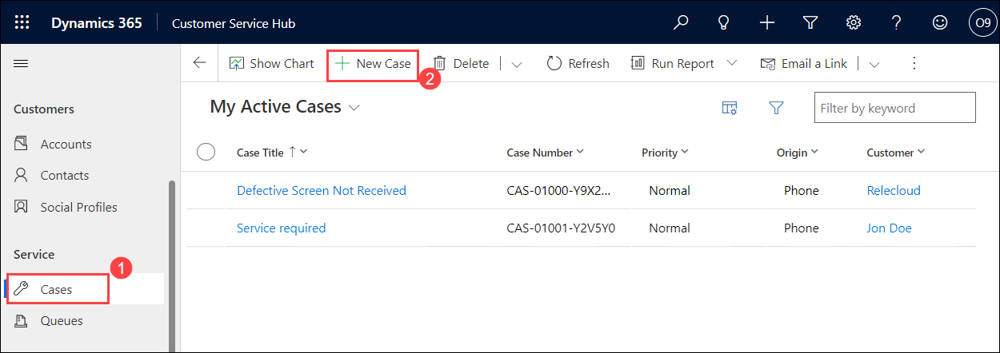

1.  Enter **Audio_System_Setup_Issues (1)** for **Case Title**, select the **Relecloud (2)** account you created in the earlier lab for **Customer**, select **Email(3)** for **Origin** and click **Save & Close (4)**. The entitlement should be applied automatically.

    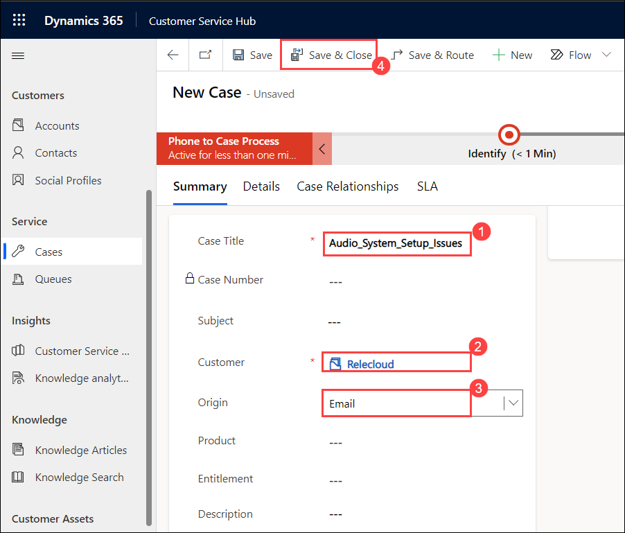

1.  Click **+ New Case**.

1.  Enter **Defective Speaker (1)** for **Case Title**, select the **Relecloud (2)** account you created in the earlier lab for **Customer**, select **Facebook (3)** for **Origin**, select the **Entitlement 1 (4)** record you created for **Entitlement** and click **Save & Close (5)**.

     

1.  Click **+ New Case**.

1.  Enter **Product_Query (1)** for **Case Title**, select the **Relecloud (2)** account you created in the earlier lab for **Customer**, select **Phone (3)** for **Origin**, select the **Entitlement 1 (4)** record you created for **Entitlement** and click **Save (5)**.

    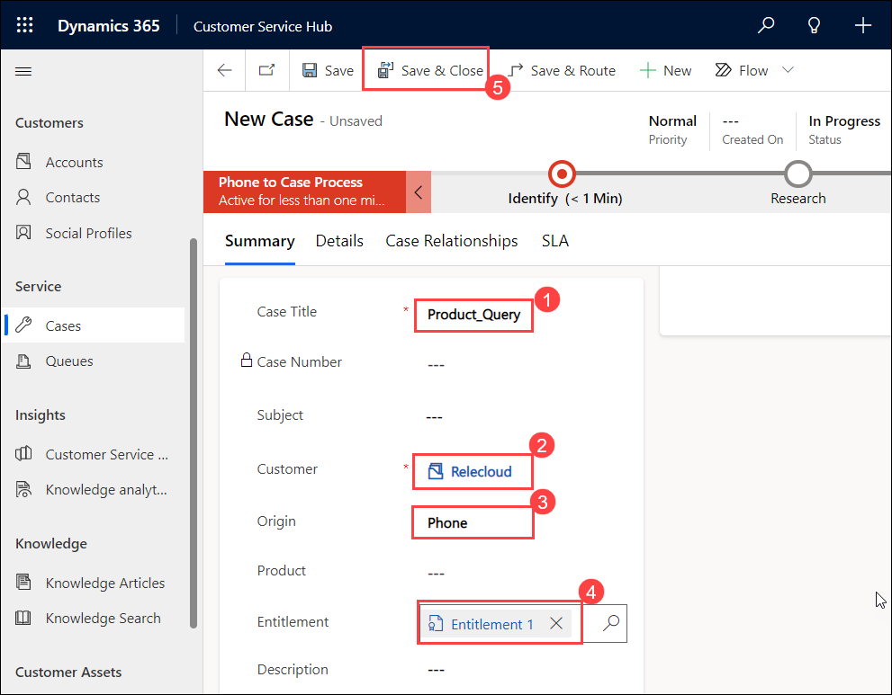

1. The following message will be displayed, *You can't create a case for this entitlement because there are no available terms.*

    

1. Click **OK**.

1. Scroll to the **Entitlement** field and click on the **Entitlement 1**. Click **Discard changes**.

1. Switch back to the **Customer service admin** page opened in the browser and click on the **Entitlement 1** created and refresh the page.

1. Go to the **Entitlement Terms** section and make sure you have **98 Remaining Terms**.

1. Go to the **Entitlement Channel** sub-grid and make sure you have **49 Remaining Terms** for **Email**, **9 Remaining Terms** for **Facebook**, **10 Remaining Terms** for **Twitter**, and **30 Remaining Terms** for **Web**.

    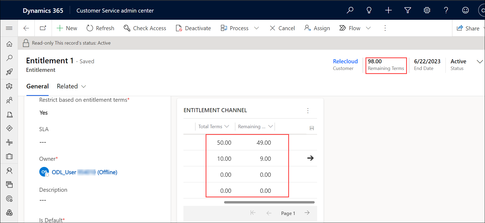
    
> **Congratulations** on completing the task! Now, it's time to validate it. Here are the steps:
> - Select the **Lab Validation** tab located at the upper right corner of the lab guide section.
> - Hit the Validate button for the corresponding task. If you receive a success message, you can proceed to the next task. 
> - If not, carefully read the error message and retry the step, following the instructions in the lab guide.
> - If you need any assistance, please contact us at labs-support@spektrasystems.com. We are available 24/7 to help you out.

## Exercise 2 – Entitlement Templates

In this exercise, you will create an entitlement template that will have 20 free terms and the customer will be able to select the channel they prefer during the entitlement creation.

### Task 1 – Create Entitlement Templates

In this task, you will create an entitlement template with 20 terms.

1.  Click on the **Customer Service Hub** app from the top and select **Customer service admin**.

     
    
1.  Using the navigation on the left, select **Service Terms** and click on **Manage** next to **Entitlements Templates**.

     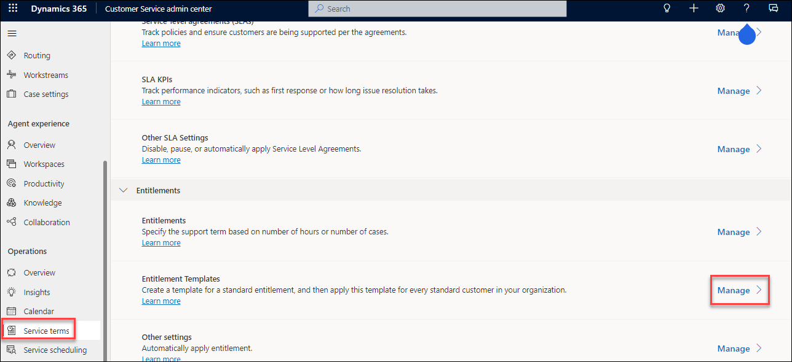

1.  Click **+ New**.

1. On **New Entitlement** page, follow the below instructions:

    - Entitlement Template Name : Enter **20_Free Terms (1)**
    - Restrict on Entitlement Terms : Choose **Yes (2)**
    - Allocation Type : Select **Number of Cases (3)**
    - Decrease Remaining On : Select **Case Creation (4)**
    - Total Terms : Enter **20 (5)**
    - Click on **Save (6)**.

     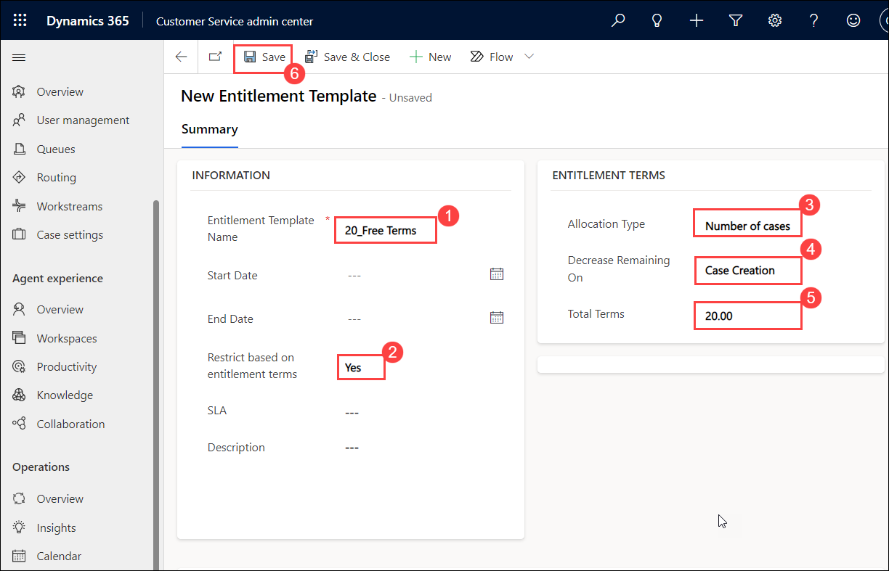
     
   > **Note:** DO NOT navigate away from this page.

1.  Go to the **Entitlement Channel** sub-grid, click on the ellipsis and select **+ New Entitlement Template Channel**.

     
     
1.  Select **Phone (1)** for **Name**, enter **20 (2)** for **Total Terms** and click **Save & Close (3)**.

     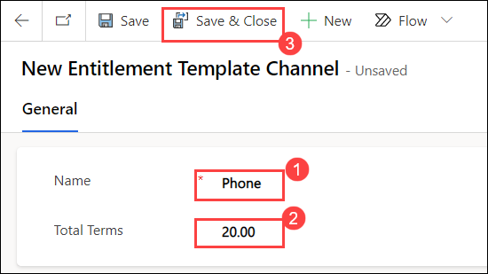
     
1.  Click on the ellipsis and select **+ New Entitlement Template Channel**.

1. Select **Email (1)** for **Name**, enter **0 (2)** for **Total Terms** and click **Save & Close (3)**.

     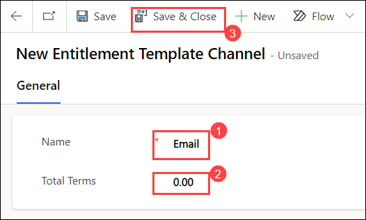
     
1. Click on the ellipsis and select **+ New Entitlement Template Channel**.

1. Select **Web (1)** for **Name**, enter **0 (2)** for **Total Terms** and click **Save & Close (3)**.

     
     
1. Click on the ellipsis and select **+ New Entitlement Template Channel**.

1. Select **Facebook (1)** for **Name**, enter **0 (2)** for **Total Terms** and click **Save & Close (3)**.

    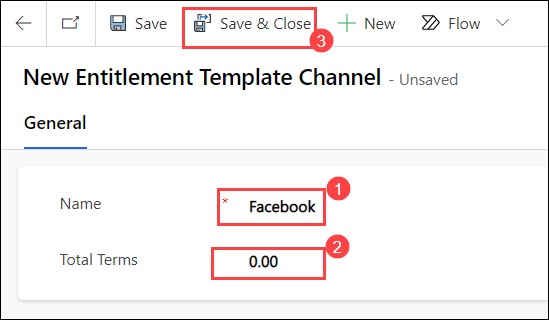
    
1. Click on the ellipsis and select **+ New Entitlement Template Channel**.

1. Select **Twitter** for **Name**, enter **0** for **Total Terms** and click **Save & Close**.

     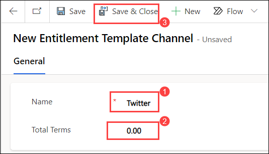
     
1. Click on the ellipsis and select **+ New Entitlement Template Channel**.

1. Select **IoT (1)** for **Name**, enter **0 (2)** for **Total Terms** and click **Save and Close (3)**.

     
     
> **Congratulations** on completing the task! Now, it's time to validate it. Here are the steps:
> - Select the **Lab Validation** tab located at the upper right corner of the lab guide section.
> - Hit the Validate button for the corresponding task. If you receive a success message, you can proceed to the next task. 
> - If not, carefully read the error message and retry the step, following the instructions in the lab guide.
> - If you need any assistance, please contact us at labs-support@spektrasystems.com. We are available 24/7 to help you out.

### Task 2 – Create Entitlement from Template

In this task, you will create 20 phone call only entitlement from the entitlement template you created.
    
1.  In the site map, select **Service terms** in Operations and click on **Manage** next to **Entitlement**

    

1.  Click on the drop-down button **(1)** next to the **+ New** button and select **From Template (2)**.

    

1.  Select **20 Free Terms** template you created for **Entitlement Template** and click **Select**.

     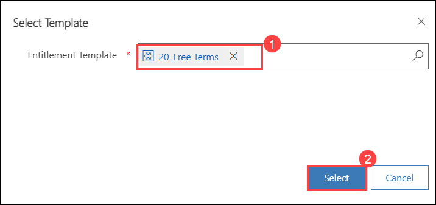
     
1.  Some of the fields will be auto-filled from the template.

1.  Enter **Phone_Call _Only_Terms (1)** for **Name**, select the **Relecloud (2)** account for **Primary Customer**, select today's date for **Start Date (3)**, select a year from today for **End Date (4)**, and click **Save (5)**.

    
    
1. Click **Activate**.

    
    
1.  Confirm activation. DO NOT navigate away from this page.

### Task 3 – Test the Entitlement

In this task, you will test the entitlement you created from the entitlement template.

1.  Switch back to the **Customer service Hub** tab.

1.  Click on **Home** at the top of the left-hand side navigation.

1.  Click on **Cases** in the **Service** section of the sitemap and click on **+ New Case**.

     

1.  Enter **Missing Parts (1)** for **Case Title** and select the **Relecloud (2)** account for **Customer**, Select **Phone (3)** for **Origin**, select **Phone Call Only Terms (4)** for **Entitlement** and click **Save (5)**.

    

1.  Click **Go back**, click **+ New Case**.

1.  Enter **Wrong cables (1)** for **Case Title** and select the **Relecloud (2)** account for **Customer**, Select **Web (3)** for **Origin**, scroll down to the **Entitlement** field and select **Phone Call Only Terms (4)**, click **Save (5)**. 

     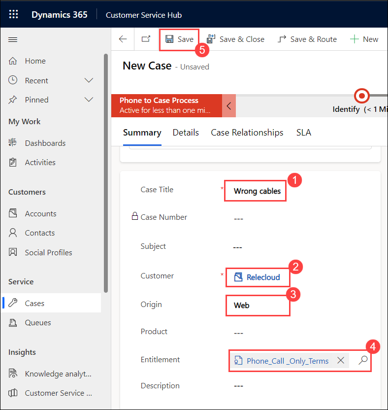
1. You will get an error telling you that there are no available terms.

1. Click **OK**.

    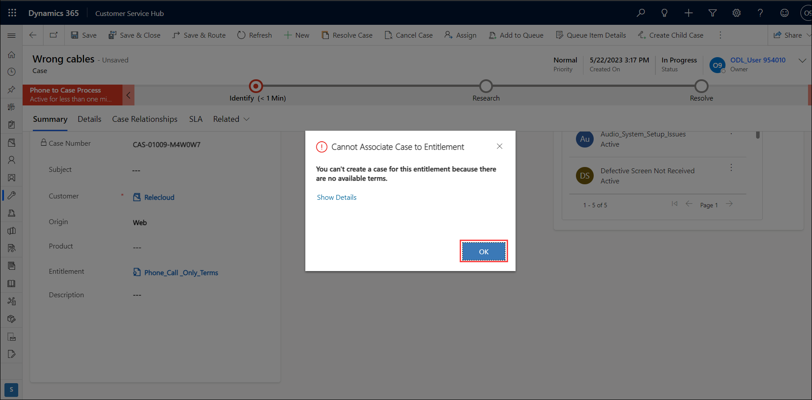

1. You should get the same error if you select Email, Facebook or Twitter for Origin.

1. Select **Web** for **Origin** and clear the **Entitlement** field.

1. Click **Save**.

1. Since you didn’t select the **Phone Call Only Terms** entitlement, the case will now be created.

1.  Click on the **Customer Service Hub** app from the top and select **Customer service admin**.

   
    
1.  In the site map, select **Service terms** in Operations. The Service Terms page appears.

1. Click on **Manage** in the **Entitlement** section.

1. Click to open the **Phone Call Only Terms** entitlement.

1. Make sure you have **19 Remaining Terms** and **19 Phone** channel **Remaining Terms**.

> **Congratulations** on completing the task! Now, it's time to validate it. Here are the steps:
> - Select the **Lab Validation** tab located at the upper right corner of the lab guide section.
> - Hit the Validate button for the corresponding task. If you receive a success message, you can proceed to the next task. 
> - If not, carefully read the error message and retry the step, following the instructions in the lab guide.
> - If you need any assistance, please contact us at labs-support@spektrasystems.com. We are available 24/7 to help you out.

## Exercise 3 – Service Level Agreements

In this exercise, you will create a Service Level Agreement and make it the default agreement.

### Task 1 – Holiday Schedule

In this task, you will create A holiday schedule to be used with Customer Service calendars.

1.  Click on the **Customer Service Hub** app from the top and select **Customer service admin**.

    
    
1.  In the site map, select **Calendar** in Operations. The Calendar page appears.

1.  In the **Holiday calendar** section, select **Manage**.

    

1.  Click **+ New**.

1.  Enter **Holidays (1)** for **Name** and click on **Create (2)**.

     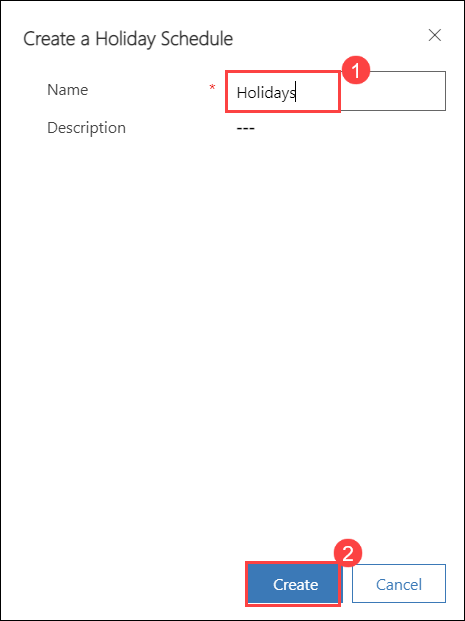

    > **Note :** If a pop-up appears stating "service-level agreements (SLAs) are deprecated in the web client" Click **I acknowledge**.

1.  In the Holidays section, click **+ New**.

1.  Enter **Local festival** for **Name**, set the **Start Date** and **End Date** to be in two days time, click **OK**.

    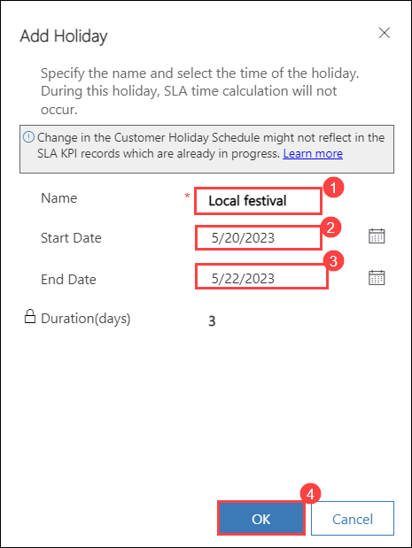
    
1. Click **Save & Close**.

> **Congratulations** on completing the task! Now, it's time to validate it. Here are the steps:
> - Select the **Lab Validation** tab located at the upper right corner of the lab guide section.
> - Hit the Validate button for the corresponding task. If you receive a success message, you can proceed to the next task. 
> - If not, carefully read the error message and retry the step, following the instructions in the lab guide.
> - If you need any assistance, please contact us at labs-support@spektrasystems.com. We are available 24/7 to help you out.

### Task 2 – Customer Service Schedule

In this task, you will create a Customer Service Schedule to use with SLAs.

1.  Click on the **Customer Service Hub** app from the top and select **Customer service admin**.

    
    
1.  In the site map, select **Calendar** in Operations. The Calendar page appears.

1.  In the **Customer service calendar** section, select **Manage**.

    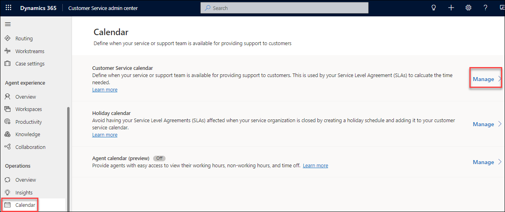

1.  Click **+ New**.

1.  Enter **Customer Service Schedule (1)** for **Name** and click on **Create (2)**.

     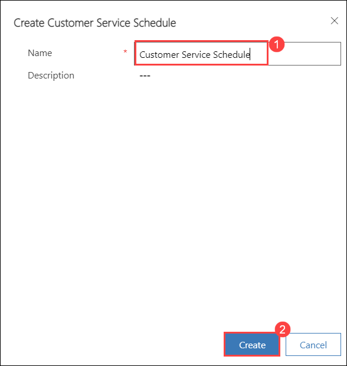
     
1.  Uncheck **Saturday (2)** and **Sunday (3)**. 

1.  Click **Set Work Hours**.

1. Set Start to **9:00AM** and End to **5:00PM**. **(4)**

1. Click **OK**.

1. Set **Holiday Schedule** to **Observe (5)** and select the **Holiday Schedule (6)** you created.

1. Select your local **Time Zone (7)**

1. Click **Save & Close (8)**.

    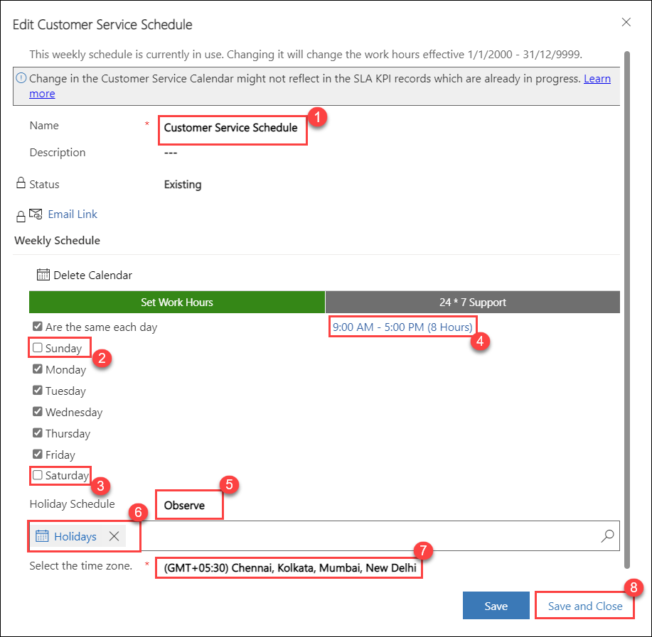

### Task 3 – Create Service Level Agreement

In this task, you will create a SLA that sets a 1 hour response time on a problem case.

1.  Click on the **Customer Service Hub** app from the top and select **Customer service admin**.

    
    
1.  In the site map, select **Service Terms** in Operations.

1.  In the **SLA KPIs** section, select **Manage**.

    

1.  Click **+ New**.

1. On **New SLA KPI** page, follow the below instructions:

    - Enter **Case Response By** for **Name**.

    - Select **Case** for **Entity Name**.

    - Select **First Response By KPI** for **KPI Field**

    - Select **Created On** for **Applicable From**

    - Click **Save**. DO NOT navigate away from this form.

      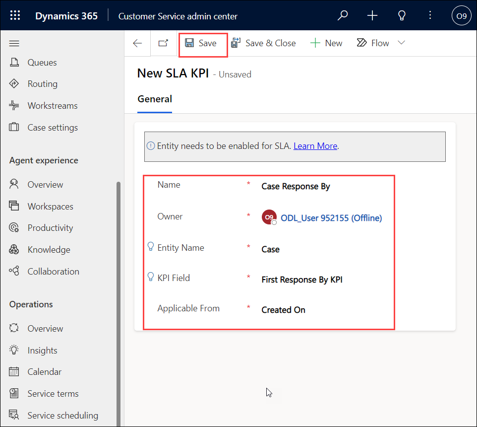

1. Click **Activate** in the command bar.

1. Click **Activate**.

1.  In the site map, select **Service Terms** in Operations.

1.  In the **Service Level Agreements** section, select **Manage**.

    

1. Click **+ New**.

1. On **New SLA** page, follow the below instructions:

    - Enter **SLA** for **Name**.

    - Select **Case** for **Primary Entity**.

    - Click **Save**.

      
      
1. Click **+ New SLA Item**

1. Enter **Problems** for **Name**.

1. Select the **SLA KPI** you created for **KPI**.

1. Select the **Customer Service Schedule** you created for **Business Hours**.

1. Under **Applicable When**, click on **Add** and **Add row**.

1. In the left-hand side of the condition, select **Case Type (Case)**.

1. Select **Equals** for the operator.

1. In the right-hand side of the condition, select **Problem**.

1. Under **Success Conditions**, click on **Add** and **Add row**.

1. In the left-hand side of the condition, select **First Response Sent (Case)**.

1. Select **Equals** for the operator.

1. In the right-hand side of the condition, select **Yes**.

1. Set **Warn After** to **45 minutes**.

1. Set **Failure After** to **1 hour**.

1. Click **Save**.

    

1. Click **Configure Actions**.

    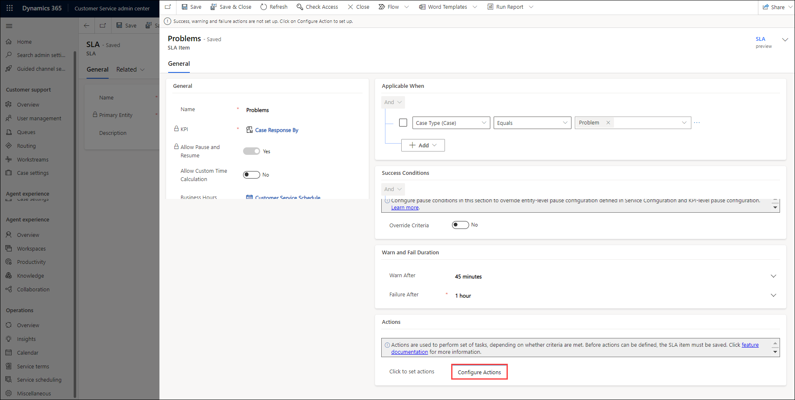

1. If prompted to connect to Dataverse, click **Continue**.

1. Expand the **Switch** step.

1. In the **Non-compliant** path, click on **Add an action**.

1. Search for an select **Microsoft Dataverse**.

1. Select the **Update a row** action.

1. Select **Cases** for **Table name**.

1. Select **Regarding ID** for **Row ID**.

1. Click **Show Advanced options**.

1. Set **Is Escalated** to **Yes**.

1. Click **Save** and close the Power Automate browser tab.

    

1. Click **Close** in the *SLA Item* dialog.

1. Click **Save**.

1. Click **Activate**.

1. Click **Activate**.

1. Click **Set As Default**. Click **OK** in the **Change default SLA** pop-up.

> **Congratulations** on completing the task! Now, it's time to validate it. Here are the steps:
> - Select the **Lab Validation** tab located at the upper right corner of the lab guide section.
> - Hit the Validate button for the corresponding task. If you receive a success message, you can proceed to the next task. 
> - If not, carefully read the error message and retry the step, following the instructions in the lab guide.
> - If you need any assistance, please contact us at labs-support@spektrasystems.com. We are available 24/7 to help you out.

### Task 4 – Service Level Agreement settings

In this task, you will configure the settings for service level agreements.

1.  Open the **Customer Service Hub** app.

1.  Click on **Settings** from the top right corner and select **Advanced settings**.

    
    
1.  On the new page, select the Settings drop down and select **Administration**.

    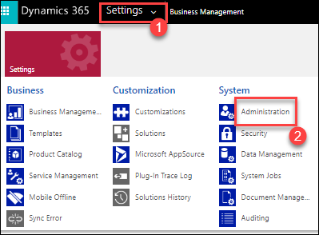

1.  In the Administrator page, select **System Settings**.

1.  Verify that the **Disable SLAs** option is set to **No**.

1.  Set the **Apply SLA after manual override** to **Yes**.

1.  In **Select SLA Pause Status**, move **On Hold** and **Waiting for Details** from **Available** to **Selected**.

1.  Click **OK**.

    

### Task 5 – Test Service Level Agreements

In this task, you will test that the SLA is applied to cases.

1.  Switch back to the **Customer service Hub** tab.

1.  Click on **Home** at the top of the left-hand side navigation.

1.  Click on **Cases** in the **Service** section of the sitemap.

1.  Click **+ New Case**.

1.  Enter **SLA_Test #1** for **Case Title** and select the **Relecloud** account for **Customer**.

1.  Select **Web** for **Origin** and click **Save**.

1.  Select **Details tab** and in **Type section** select **Problem** from the drop down click **Save**.

    

1.  Select the **SLA** tab. You should see the Case Response By SLA KPI in progress with failure time set to 1 hour's time.

1.  Select the **Details** tab and set **First Response Sent** to **Yes** and click **Save**.

1.  Select the **SLA** tab. You should see the Case Response by SLA KPI with status on **Succeeded**.

     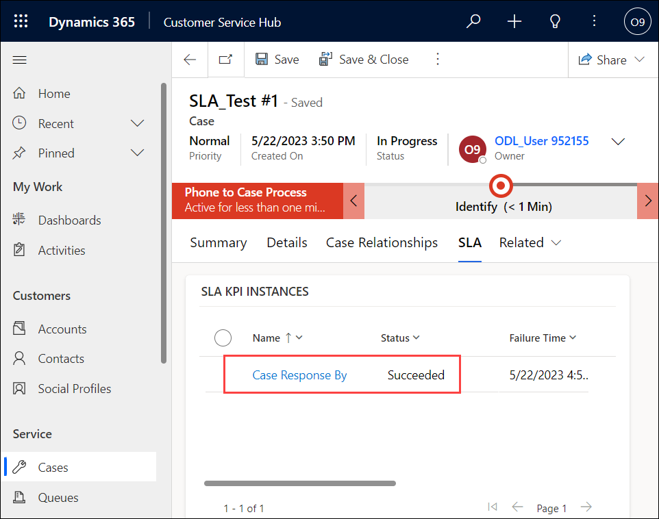
     
1.  Click **Go back**, click **+ New Case**.

1. Enter **SLA_Test #2** for **Case Title** and select the **Relecloud** account for **Customer**.

1. Select **Email** for **Origin** and click **Save**.

    
    
1. Select the **SLA** tab. There should be no SLA KPI items.

> **Congratulations** on completing the task! Now, it's time to validate it. Here are the steps:
> - Select the **Lab Validation** tab located at the upper right corner of the lab guide section.
> - Hit the Validate button for the corresponding task. If you receive a success message, you can proceed to the next task. 
> - If not, carefully read the error message and retry the step, following the instructions in the lab guide.
> - If you need any assistance, please contact us at labs-support@spektrasystems.com. We are available 24/7 to help you out.

**Result:** You have successfully created the Entitlements, Entitlement Templates, and Service Level Agreements in this lab. 

### Review
In this lab, you have completed:
- Creating an entitlement for your user
- Adding Channels to the entitlement and Tested the Entitlement
- Creating Entitlement Templates and Tested the Entitlement
- Holiday Schedule and Customer Service Schedule
- Creating and testing Service Level Agreement and settings

### **Proceed with the next Lab.**
