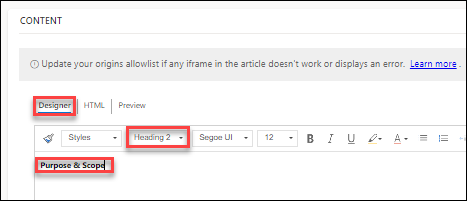
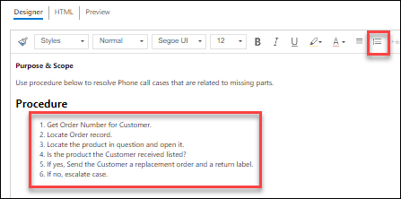
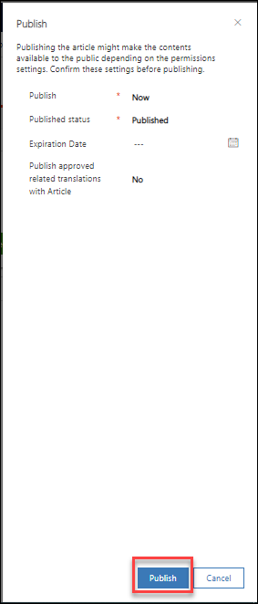

# Practice Lab 6 – Knowledge management

## Scenario

As a customer care coordinator at City Power & Light, you are responsible for instructing the customer service team and providing them with troubleshooting articles to support case resolution. You need to create a knowledge article within Dynamics 365 for Customer Service. In this lab, you will create a knowledge article, walk through the publishing process and then revise that article.

> `Important`: The **[DeploymentId]/[DID] can be found under the environment details tab in the user name (example: `odl_user_xxxxxx.onmicrosoft.com`) **xxxxxx** is the [DeploymentID]**.

## Exercise 1 – Knowledge Management

In this exercise, you will create, approve, publish, and revise an internal Knowledge Article for missing parts.

### Task 1 – Create Internal Article

In this task, you will create an internal Knowledge Article for missing parts.

1.  Open the **Customer Service Hub** app.

2.  Click on **Home** at the top of the left-hand side navigation.

3.  Click on **Knowledge Articles** in the **Knowledge** section.

4.  Click **+ New**.

7.  Enter **odl_user_DID_Missing Parts** for **Title**, enter **missing, parts** for **Keywords** and click **Save**.

    

8.  Go to the **Content** area and make sure you have the **Designer** tab selected.

9.  Type **Purpose & Scope**.

10. Click on the **Paragraph Format** selector and select **H2**. This option will only appear if your screen is fully expanded.

    

11. Hit the **Enter** key to start a new line. The **Format Selector** should change back to **Normal**.

12. Type the paragraph below.

    Use procedure below to resolve Phone call cases that are related to missing parts.

13. Hit the **Enter** key to start a new line.

14. Click on the **Paragraph Format** selector and select **Heading 2**.

15. Type **Procedure**.

16. Hit the **Enter** key to start a new line.

17. Go to the ribbon and click **Insert/Remove Numbered List**. This action will insert numbered list.

18. Provide the steps below.

    1.  Get Order Number for Customer.
    2.  Locate Order record.
    3.  Locate the product in question and open it.
    4.  Is the product the Customer received listed?
    5.  If yes, Send the Customer a replacement order and a return label.
    6.  If no, escalate case.

    

19. Click Save.

20. Go to the **Business Process Flow** and click on the **Author** stage.

21. Select **Default subject** for **Article Subject**, check the **Mark for Review** checkbox, and click **Next Stage**.

    

### Task 2 – Approve and Publish Knowledge Article

In this task, you will assume the role of the Knowledge Article Approver and Approve the Knowledge Article you created, and then publish it.

1.  Go to the **Business process flow** and click on the **Review** stage.

2.  Select **Approved** for **Review**.

3.  Click **OK**.

4.  Go to the **Business process flow** and click on the **Review** stage.

5.  Click **Next Stage**.

6.  Click on the **Publish** stage.

7.  Check the **Set Product Associations** checkbox and click **Finish**.

8.  Go to the command bar and click **Publish**. You may need to click the ellipsis to see it.

9.  Select **Now** for **Publish**, **Published** for **Published Status**, and click **Publish**. Do NOT navigate away from this page.

    

### Task 3 – Revise Knowledge Article

In this task, you will change step 6 of the Knowledge Article you created from Escalate Case to Assign to Manager, and then you will revise the Knowledge
Article.

1.  Make sure you still have the Knowledge Article you created opened.

2.  Click **Create minor version** from the command bar. You may need to click the ellipsis to see this

3.  Click **OK**.

4.  Go to the **Content** section.

5.  Replace step **6** of the **Procedure** from **If no, escalate case** to **If no, assign to manager**.

6.  Click **Save**.

    

7.  Click **Approve**. You may need to click the ellipsis to see this. Click **OK**.

8.  Click **Publish**.

    

9. Select **Now** and click **Publish** again.

10. Click on **Knowledge Articles** in the **Knowledge** section.

11. You should find the new version of the **Missing Parts** article in the **My Active Articles** view but not the old version.

12. Change the view to **Archived Articles**. You should find the old version of the **Missing Parts** article in this view.
