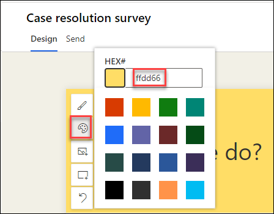
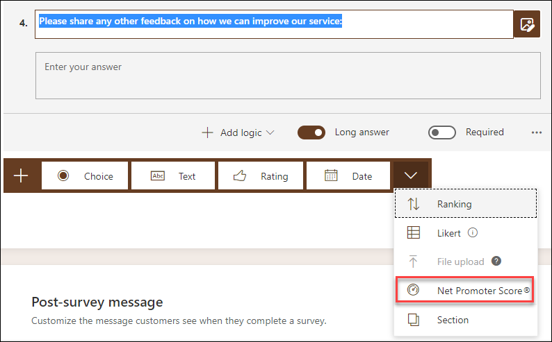
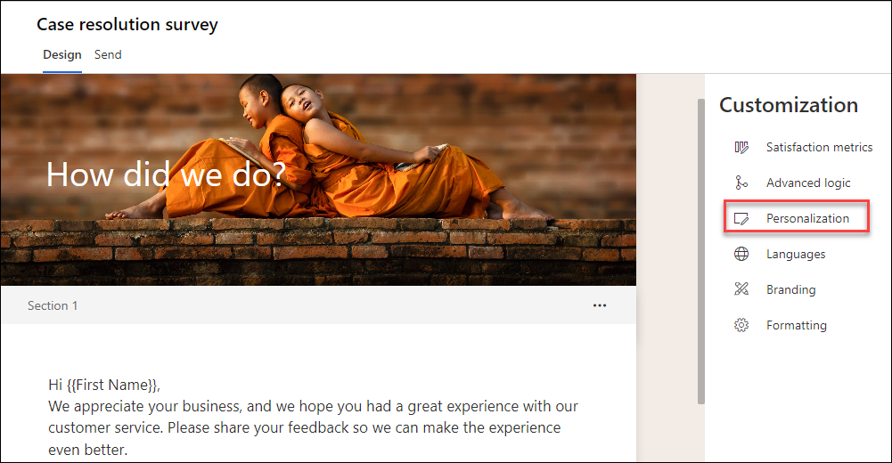
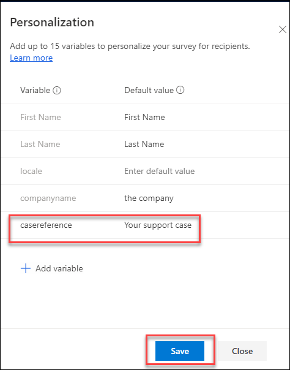
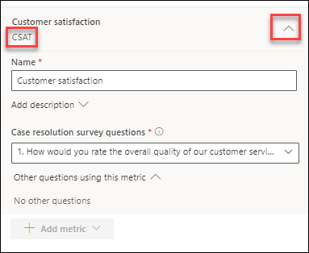
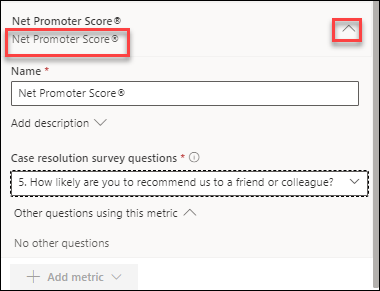
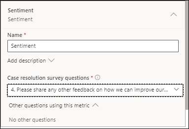
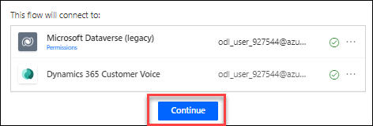
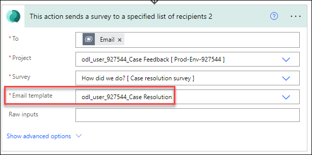

# Practice Lab 7 – Customer Voice

## Scenario

You are a customer service manager at City Power & Light who has been tasked with trying the new Customer Voice functionality to capture feedback on cases before rolling it out to your customers.

## Exercise 1: Create survey

In this exercise, you will create a project and use a template to create a survey.

### Task 1: Create project

1.  Navigate to <https://customervoice.microsoft.com>

1. If not Sign-in, then on the **Sign into Microsoft Azure** tab you will see the login screen, in that enter following **Email/Username** and then click on **Next**. 
   * Email/Username: <inject key="AzureAdUserEmail"></inject>
   
    
    
1. Now enter the following **Password** and click on **Sign in**.
   * Password: <inject key="AzureAdUserPassword"></inject>

1.  Click **+ New project**.

1.  Select the **Support** template

    

1.  Click **Next**.

1. Select **See all environments** from the recent locations.

1.  Select the **Prod-Env-[DeploymentID]** Dynamics 365 environment and click on select and close..

1.  Click **Create**.

1.  Click on **All Projects**

1.  Click on the ellipsis next your project and select **Rename**.

1.  Enter **odl_user_DID_Case Feedback** and click on **Rename**.

     

### Task 2: Customize survey

1.  Select your project.

2.  Click in the **Header** and change **Customer Service feedback** to **How did we do?**.

3.  Hover the mouse over the header and click on the **Theme color** icon and change name inside HEX# box to **ffdd66**.

    

4.  Hover the mouse over the header and click on the **Image** icon and choose one of the images from the gallery.

5.  Select question 1 and set as **Required**.

    

6.  Select question 2 and set as **Required**.

7.  Select the last question in the survey and click on **+ Add new** and click on the chevron(V) and select the **Net Promoter Score** question type. Set the question as **Required**.

    

8.  Click on **Post-survey message** and change the Heading from *Thanks!* to **Thank you for your feedback** and change the Message to **We look at all feedback to improve our service.**

    

9.  Click in the Footer and enter **The feedback you submit will not be shared outside of the company.**

10. Expand **Customization** and select **Personalization**

    

11. Click + **Add variable** and enter **casereference** with default value **Your support case**.

12. Click **Save**.

    

13. Click **Close**.

14. Select **Formatting** from **Customization**.

15. Toggle **Progress bar** to **Off** and close the formatting pane.

    

16. Click into the section header and clear the text *Input your title here*, click on the **variables** drop down and select **casereference**.

17. Add the text **has been resolved**.

18. Click **Preview**.

19. Click **Back**.

### Task 3: Satisfaction metrics

1.  Select your survey.

2.  Expand **Customization** and select **Satisfaction metrics**

3.  Click **+ Add metric**

4.  Select **CSAT** and select the first question.

    

5.  Click **Save**.

6.  Click **+ Add metric**

7.  Select **Net Promoter Score** and select the last question.

    

8.  Click **Save**.

9.  Click **+ Add metric**

10.  Select **Sentiment** and select the text question.

     

11.  Click **Save**.

## Exercise 2: Send survey

In this exercise, you will create an email template and send the survey by email.

### Task 1: Configure email template

1.  Navigate to <https://customervoice.microsoft.com>

2.  Select your project.

3.  Click on the **Send** tab.

4.  Click on the **Email** tile.

    

5.  Click on the **Template** drop-down and select **Create new**.

6.  Enter **odl_user_DID_Case Resolution** and click **Add**.

7.  Click on the **Insert** drop-down and select **First question in survey**.

8.  Replace the subject line with **Please provide feedback on**, click on the **Insert** drop-down and select **Personalized variables** and then select **casereference**.

9.  Click **Save**

10. Click **Cancel**

### Task 2: Send the survey

1.  Click on the **Send** tab.

2.  Click on the **Email** tile.

3.  Click on the **Template** drop-down and select the **Case Resolution** template you created.

4.  Click in the Recipients field and enter your email address.

5.  Click **Send**

## Exercise 3: Send survey when a case is resolved

In this exercise, you will use Power Automate to send a survey when a case is resolved.

### Task 1: Configure automation

1.  Navigate to <https://customervoice.microsoft.com>

2.  Select your project.

3.  Click on the **Send** tab.

4.  Click on **Resend** and select **Automate**.

5.  Select the **Send a survey when a case is resolved in Dynamics 365** template. You may need to click on **See more templates**.

    

6.  If the connections require action, click **Fix connection** and sign in when prompted.

7.  Click **Continue**.

    

8.  Select the **Prod-Env-[DeploymentID]** Dynamics 365 environment.

9.  Click **Create**.

10. Navigate to <https://flow.microsoft.com>

11. Sign in with your Dynamics 365 tenant credentials.

12. Switch to the **Prod-Env-[DeploymentID]** Dynamics 365 environment.

13. Click on **My flows**

    

14. Select the **Send a survey when a case is resolved in Dynamics 365** flow and click **Edit**.

15. Expand the steps in the flow and select the send a survey steps.

16. Clear the **Email** template field and select the **Case Resolution** template you created.

    

17. Click **Save**.

**Result:** You have successfully created the survey and Sent survey when a case is resolved. 
