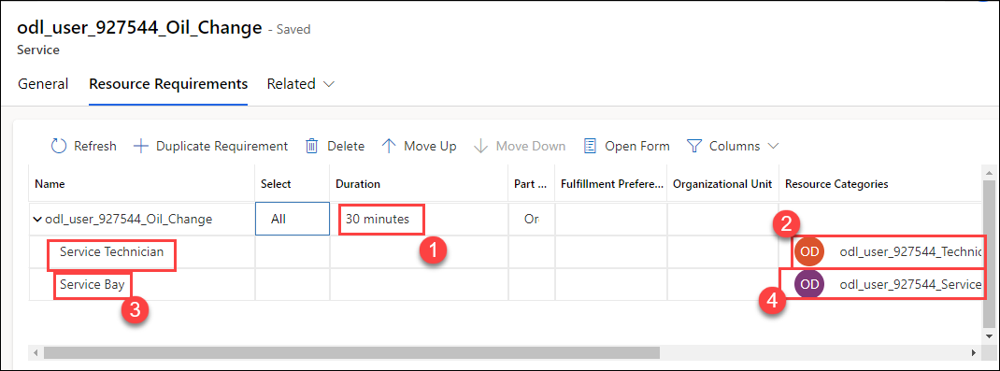
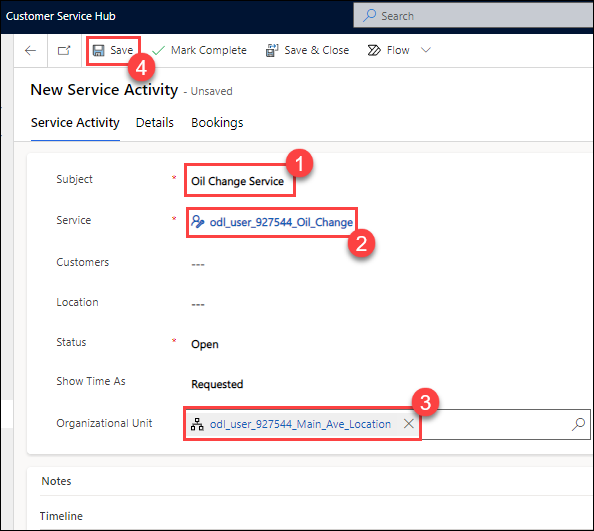
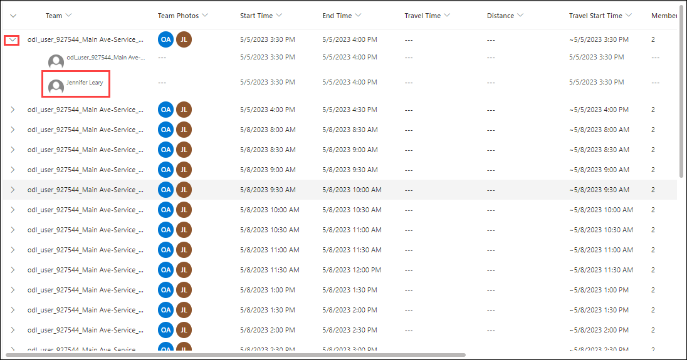
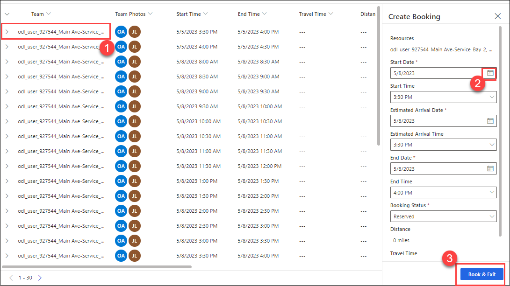
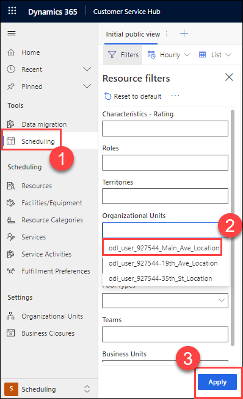
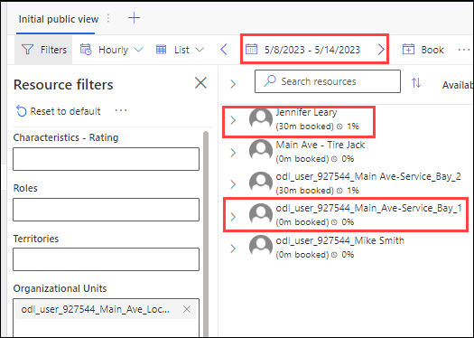

# Practice Lab 9 – Customer Service Scheduling Services

## Scenario

You are the scheduling manager at City Power & Light who has been tasked with testing the Service Scheduling functionality to perform services for customers at your locations.

## Exercise 1: Define Services

In this exercise, you will define oil change and tire rotation services.

### Task 1: Create Oil Change Service

In this task you will create an oil change service.

1.  Open the **Customer Service Hub** app.

2.  Click on **Home** at the top of the left-hand side navigation.

3.  Click on **Service** at the bottom of the **Site Map** in the left-hand navigation and select **Scheduling**.

4.  Click on **Services** in the **Scheduling** section.

5.  Click **+ New**.

    

6.  Enter **odl_user_DID_Oil_Change** for **Name** and click **Save**.

    

7.  Select the **Resource Requirements** tab, change the **Name** to **odl_user_DID_Oil_Change**, select **All** for **Select**, and select **Organizational Unit** for **Part of Same**.

    

8.  Click **+ Requirement**.

9. Enter **30 minutes** for **Duration**.

10.  Enter **Service Technician** for **Name** and select **Technician** for **Resource Category**.

11. Select the **Oil Change** row and click **+ Requirement**.

12. Enter **Service Bay** for **Name**, select **Service Bay Facility** for **Resource Category**

    

13. Click **Save**

### Task 2: Create Tire Service

1.  Click + **New** in the command bar.

2.  Enter **odl_user_DID_Tire_Rotation** for **Name** and click **Save**.

3.  Select the **Resource Requirements** tab, change the **Name** to **odl_user_DID_Tire_Rotation**, select **All** for **Select**, and select **Organizational Unit** for **Part of Same**.

4.  Click **+ Requirement**.

5.  Enter **1 hour** for **Duration**.

6.  Enter **Senior Technician** for **Name** and select **Senior Technician** for **Resource Category**.

7.  Select the **Tire Rotation** row and click **+ Requirement**.

8. Enter **Service Bay** for **Name** and select **Service Bay Facility** for **Resource Category**.

9.  Select the **Tire Rotation** row and click **+ Requirement**.

10. Enter **Service Technician** for **Name** and select **Technician** for **Resource Category**.

11. Select the **Tire Rotation** row and click **+ Requirement**.

12. Enter **Tire Jack** for **Name** and select **Tire Jack Equipment** for **Resource Category**.

13. The **Tire Rotation** service should now have **4** requirements.

    
    
> **Congratulations** on completing the task! Now, it's time to validate it. Here are the steps:
> - Select the **Lab Validation** tab located at the upper right corner of the lab guide section.
> - Hit the Validate button for the corresponding task. If you receive a success message, you can proceed to the next task. 
> - If not, carefully read the error message and retry the step, following the instructions in the lab guide.
> - If you need any assistance, please contact us at labs-support@spektrasystems.com. We are available 24/7 to help you out.

## Exercise 2: Create and schedule Service activities 

In this exercise, you create and schedule service activities for an oil change and a tire rotation.

### Task 1: Schedule Oil Change Service

In this task you will create and schedule an oil change service activity.

1.  Open the **Customer Service Hub** app.

2.  Click on **Home** at the top of the left-hand side navigation.

3.  Click on **Service** at the bottom of the **Site Map** in the left-hand navigation and select **Scheduling**.

4.  Click on **Service Activities** in the **Scheduling** section.

5.  Click **Service Activity**.

    

6.  Enter **Oil Change Service** for **Subject**, select **odl_user_DID_Oil_Change** for **Service**, select **Main Ave Location** for **Organizational Unit**, and
    click **Save**.
    
    

7.  Click **Book**.

8.  Go to the **Filter View**, select **Main Ave Location** for **Organizational Unit**, and click **Search**.

    

9.  Expand one of the available slots and see what resources are included in it. In our case Service Bay 1 and Jennifer Leary will be included.

    

10. Click on the Team date from the list.

11. Select a date one week from today(Do not select weekend date). The rest of the dates will change to reflect the change you made.

12. Click **Book & Exit**.

    

13. Refresh the service activity record.

14. The status should now change form **Requested** to **Scheduled**.

15. Select the **Bookings** tab. You should see the booked resources for this service activity.

    

16. Click **Scheduling** in the **Tools** section.

17. Select **Main Ave Location** for **Organizational Units** and click **Apply**.

    

18. Select **Horizontal View** and click on the date picker.

19. Select the date you booked the **Oil Change** service activity.

20. **Jennifer Leary** and **Service Bay 1** should show as booked for **30** minutes. Click on the **Jennifer Leary’s** booking to get the deatils of booking.

    

21. Go to the Details pane. You should see more information about the booking.

> **Congratulations** on completing the task! Now, it's time to validate it. Here are the steps:
> - Select the **Lab Validation** tab located at the upper right corner of the lab guide section.
> - Hit the Validate button for the corresponding task. If you receive a success message, you can proceed to the next task. 
> - If not, carefully read the error message and retry the step, following the instructions in the lab guide.
> - If you need any assistance, please contact us at labs-support@spektrasystems.com. We are available 24/7 to help you out.

**Result:** You have successfully created Customer Service Scheduling Services in this lab.
