# Practice Lab 11 – Agent Collaboration

## Scenario 

Your organization provides billing and customer support on the Circuit Boards and other electronic products that it manufactures. With more and more new agents coming on board, your organization is looking for more ways to help newer agents solve customer problems faster. One way that they have identified how to do this by providing more collaboration options for their agents. Since they use Microsoft Teams, they have decided to leverage the collaboration capabilities available between Microsoft Teams and Dynamics 365.

Throughout this lab, you will configure the different collaboration features available. Upon successful completion of the lab, you will have performed the following:

-   Enabled the Embedded Teams Collaboration features.
-   Enabled the Case Swarming Feature.
-   Configured the Case Swarming Capabilities.

## Exercise 1: Enable the necessary collaboration features in your environment 

Before your agents can begin collaborating with subject matter experts at your organization, you will need to ensure that you have enabled the necessary features in your environment.

### Task 1: Enable collaboration features

1.  Open the **Dynamics 365 - Customer Service admin center** application.
    
    

2.  Using the navigation on the left, select **Collaboration (1)**.

3.  Select **Manage (2)** next to **Embedded chat using Teams**.

    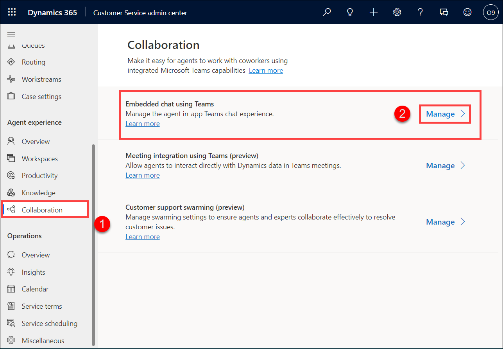

4.  Set the following Items to **Yes**

    -   Turn on the linking of Dynamics 365 records to Microsoft Teams channels (1)

    -   Turn on Microsoft Teams chats inside Dynamics 365 (2)

5.  Select the **Save (3)** button.

    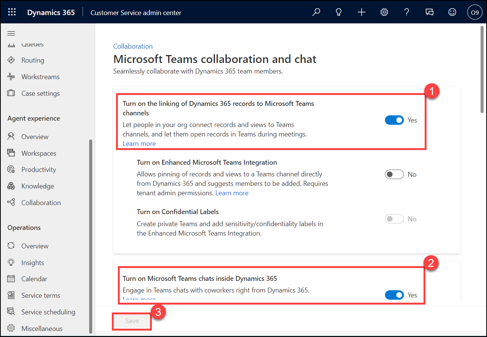

6.  Using the navigation on the left, select Collaboration again.

7.  Select **Manage** next to **Customer support swarming**.

8.  On the **Customer support swarming** screen, ensure that Swarming is set to
    **On**.

    

9.  Under the **Case details** section, select **Activate case form for
    swarming**. This should open the Power Apps portal in a new tab.

    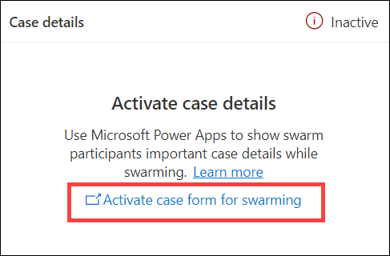

10. From the list of available case forms, locate the **Case form for
    swarming**.

    -   Check if the status of the form is set to **On**. 
    -   If the status of the form is set to **Off,** select the **vertical ellipsis** next to the from name, and from the menu that appears, select **Turn On**.

     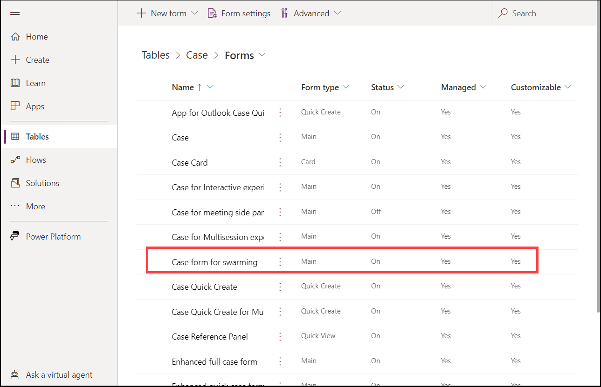
    
 11. From the left navigation menu of the **Power Apps** screen, Click on **Solutions (1)** then click on **Publish all customizations (2)**.
 
      
      
 12. Go back to the **Customer support swarming** screen, you can see that **Case details** is now **Activated**.
        
      
        
 13. Under the **Experts** section, click on **Add a new expert**; then click on **Add Swarm experts**
 
      
       
 12. On **Add Swarm Expert** page, select ODL_User (1) then click on **ADD (2)**.

      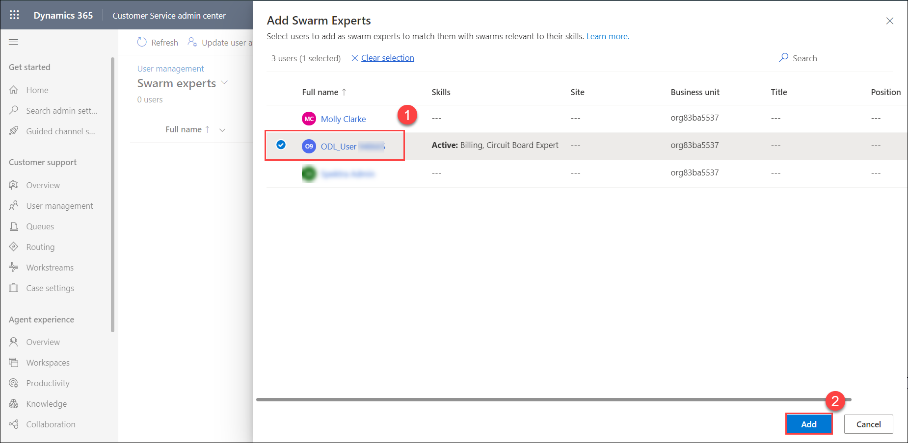

### Task 2: Create bookable resource records that can be used as experts.

1.  In the **Dynamics 365 - Customer Service Admin Center** application, use the navigation on the left to select **Service scheduling**, and locate **Resources** and select **Manage**.

    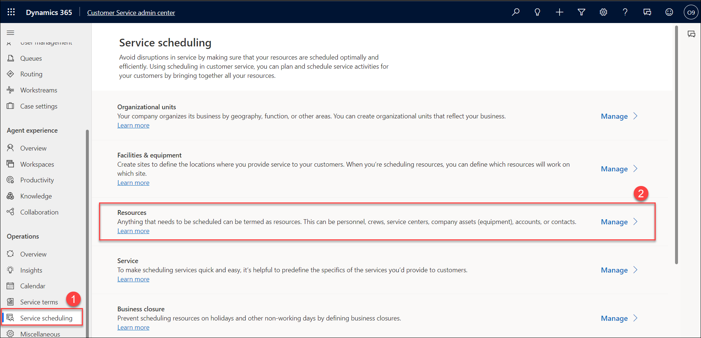

3.  From the **Active Bookable Resources** screen, Click on **New** from the command bar.

4.  Configure the new Bookable resource as follows:

    1.  **Resource Type:** User

    2.  **User (1):** ODL_User_<unique_value>.

    3.  **Name: (2)** Alan Steiner

5.  Leave everything else as is and select the **Save and Close (3)** button.

    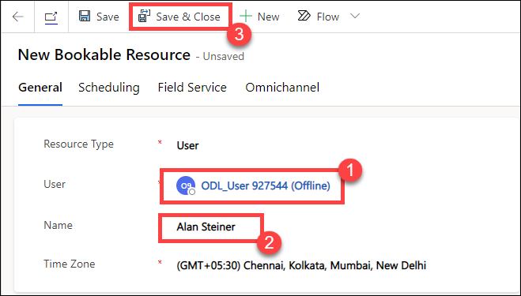

> **Congratulations** on completing the task! Now, it's time to validate it. Here are the steps:
> - Select the **Lab Validation** tab located at the upper right corner of the lab guide section.
> - Hit the Validate button for the corresponding task. If you receive a success message, you can proceed to the next task. 
> - If not, carefully read the error message and retry the step, following the instructions in the lab guide.
> - If you need any assistance, please contact us at labs-support@spektrasystems.com. We are available 24/7 to help you out.

## Exercise 2: Configure Case Swarming

Now that we have enabled the necessary features and have defined the resources that will be used as part of our solution, we are now going to configure the Case Swarming capabilities in the application. This will consist of two primary tasks:
 - Defining Skills & assigning those Skills to Experts
 - Defining Condition rules to assign Skills to swarming requests

### Task 1: Configure skills

1.  In the **Dynamics 365 - Customer Service Admin** center, using the navigation on the left under the **Customer support**, select **User management**

2.  Next to **Skills**, select the **Manage** button.

    

3. On the **Active Characteristics** screen, select the **New** button from the command bar.

4.  Configure the Characteristic as follows:

    -   **Name: (1)** Billing
    -   **Type: (2)** Skill
    -   **Description: (3)** Expert for Billing questions

5.  Select the **Save (4)** button to save the record and leave it open.

    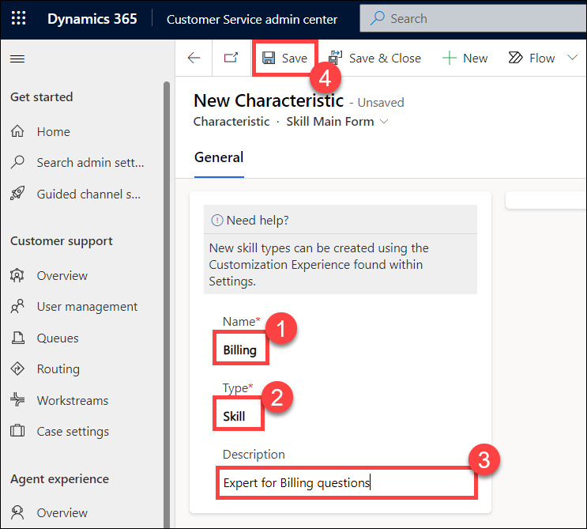

6.  Click on **Related** tab, and select the **Bookable Resource Characteristics** from the drop down. 
    
     
     
     This will open the **Bookable Resource Characteristics** tab.

7.  Select the **New Bookable Resource Characteristic** button. .

    

8. Configure the **Bookable Resource Characteristic**. From the dropdown (1) select the **Information (2)** and add the following:

    -   **Skill Name:** Billing

    -   **User (Agent):** Alan Steiner

9. Select **Save and Close (4)**

    

10. Select **Save and Close** to close the **Billing** skill.

11. Back on the **Active Characteristics** screen, select the **New** button
    from the command bar.

12. Configure the Characteristic as follows:

    1.  **Name:** Circuit Board Expert
    2.  **Type:** Skill
    3.  **Description:** Expert in repairing Circuit boards

13. Select the **Save** button to save the record and leave it open.

14. Click on the **Related** tab, and from the menu that appears, select **Bookable Resource Characteristics**.
    This will open the **Bookable Resource Characteristics** tab.

15. Select the **New Bookable Resource Characteristic** button.

16. Configure the Bookable Resource Characteristic as follows:

    1.  **Skill Name:** Circuit Board Expert
    2.  **User (Agent):** Alan Steiner

17. Select **Save and Close**.

18. Select **Save and Close** to close the Circuit Board Expert skill.

    

> **Congratulations** on completing the task! Now, it's time to validate it. Here are the steps:
> - Select the **Lab Validation** tab located at the upper right corner of the lab guide section.
> - Hit the Validate button for the corresponding task. If you receive a success message, you can proceed to the next task. 
> - If not, carefully read the error message and retry the step, following the instructions in the lab guide.
> - If you need any assistance, please contact us at labs-support@spektrasystems.com. We are available 24/7 to help you out.

### Task 2: Create Condition rules to assign necessary skills

1.  Using the navigation on the left, select the **Collaboration** and select **Manage** on the **Customer support swarming**.

    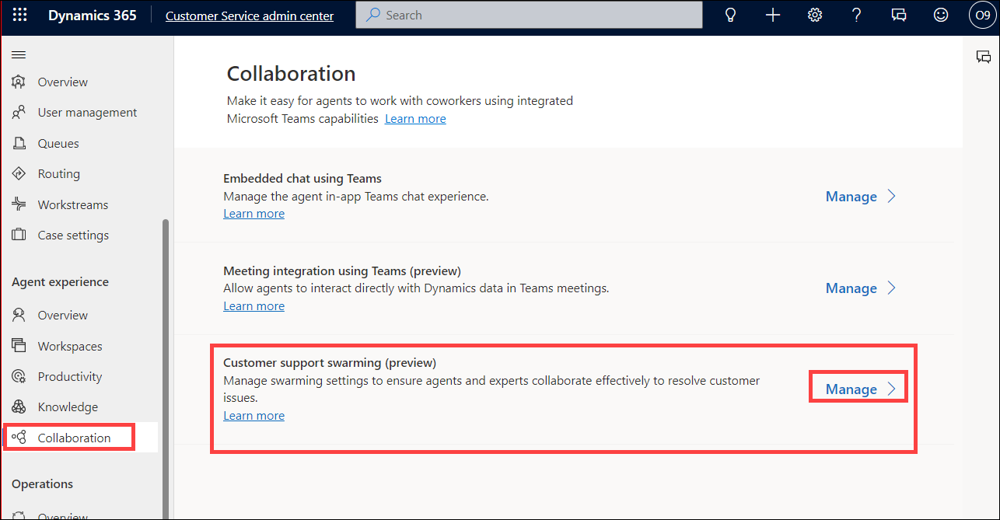

2.  Under the **Condition Rules** section, select the **Create Rule** button.

    

3.  In the **Rule Name** field, enter **Billing rule. (1)**.

4.  Configure the conditions section as follows:

    1.  **Swarm request** – **Contains** – **Billing**

    2.  Delete the Swarm related record condition (3).

    

5.  In the **Skills** section, select the **Lookup (1)** Icon.

6.  In the **Lookup Records** box, select the **Look for Characteristic** field.

7.  Enter the text **Billing**.

8.  Select the **Billing (2)** skill.

9.  Select the **Add (3)** button.

    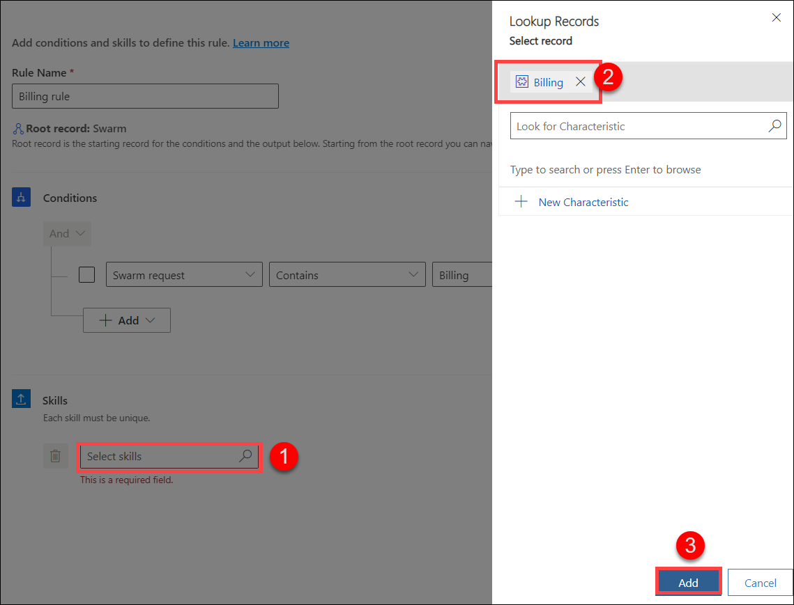

10. Back on the **Create swarm rule** screen, select the **Create** button.

11. In the **Condition rules** section select the **See more** icon.

    

12. In the **Decision List** screen, select the **Create Rule** button.

    

13. In the **Rule Name** field, enter **Circuit Board Rule**.

14. Configure the conditions as follows:

    1.  **Swarm request** – **Contains** – **Circuit Board**

    2.  Delete the Swarm related record condition.

15. In the **Skills** section, select the **Lookup** Icon.

16. In the **Lookup Records** box, select the **Look for Characteristic** field.

17. Enter the text **Circuit**.

18. Select the **Circuit Board Expert** skill.

19. Select the **Add** button.

20. Back on the **Create swarm rule** screen, select the **Create button**.

    

## Exercise 3: Leverage the different collaboration features 

### Task 1: Initiate an embedded Teams Chat

1.  Open the **Dynamics 365 - Customer Service Workspace** application.

    

2.  One the **Customer Service Agent Dashboard**, select the **New Case** button
    on the **My Active Cases** sub-grid.

    

3.  In the **Quick Create Case** screen, configure the new case record as
    follows.

    -   **Customer:** Relecloud **(1)**

    -   **Case Title:** Circuit Board Damaged )**(2))**

    -   **Case Type:** Problem  **(3)**

    -   **Case Status:** In Progress

    -   **Priority:** Normal

4.  Select the **Save and Close (4)** button.

    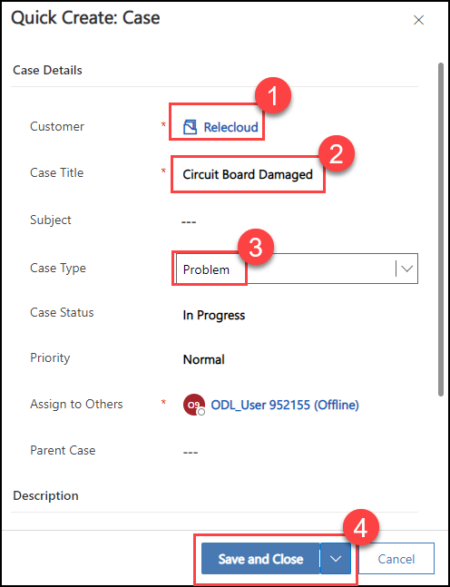

5.  In the **My Active Cases** sub-grid, Open the **Circuit Board Damaged** case.

6.  On the right side of the screen, in the **Productivity Pane**, select the **Microsoft Teams** icon.

9.  Select the **Start a New Chat** button.

    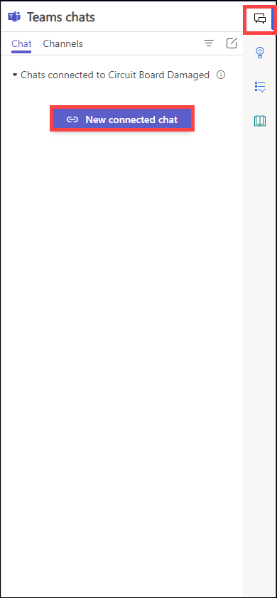

10. In the **Name** field, select **Molly Clarke**.

    

11. Enter the Message you want to send to Molly.

    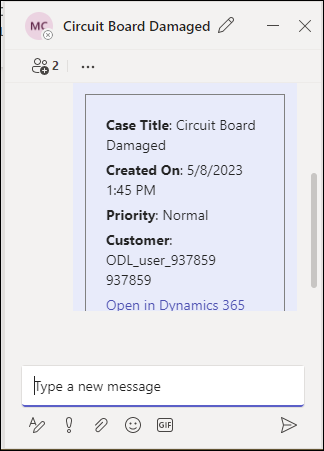

> **Congratulations** on completing the task! Now, it's time to validate it. Here are the steps:
> - Select the **Lab Validation** tab located at the upper right corner of the lab guide section.
> - Hit the Validate button for the corresponding task. If you receive a success message, you can proceed to the next task. 
> - If not, carefully read the error message and retry the step, following the instructions in the lab guide.
> - If you need any assistance, please contact us at labs-support@spektrasystems.com. We are available 24/7 to help you out.

### Task 2: Create a Case Swarm

Another way you can locate help is to initiate a swarm request. When initiating
a case swarm the system will identify multiple Experts you could potentially
assist you in resolving your issue.

1.  On the **Case** record select the **Create Swarm** button. (*You may need to select the vertical Ellipsis to display more options*.)

    

2.  In the **Swarm Request (1)**, enter the text **Having a Billing Issue**.

3.  In the **Steps already tried (2)** field, enter **Tried issuing a credit.**

4.  Notice that the **Billing (3)** skill has already been added to the skills.

5.  Click in the **Enter more skills (3)** field, and select **Circuit Board Expert**.

    

6.  Select the **Save and Send (4)** invitation button.

7.  After a short period of time, a new **Swarm** will appear. You can enter text into the message section.

    

> **Congratulations** on completing the task! Now, it's time to validate it. Here are the steps:
> - Select the **Lab Validation** tab located at the upper right corner of the lab guide section.
> - Hit the Validate button for the corresponding task. If you receive a success message, you can proceed to the next task. 
> - If not, carefully read the error message and retry the step, following the instructions in the lab guide.
> - If you need any assistance, please contact us at labs-support@spektrasystems.com. We are available 24/7 to help you out.

**Result:** You have successfully Enable the necessary collaboration features in your environment and Configured Case Swarming in this lab.
